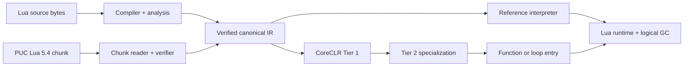

<p align="center">
  
</p>

<h1 align="center">Lunil</h1>

<p align="center">
  A correctness-first Lua 5.4 compiler and managed runtime for modern .NET.
</p>

<p align="center">
  <strong>English</strong> · <a href="README.zh-CN.md">简体中文</a>
</p>

<p align="center">
  <a href="https://github.com/dlqw/Lunil/actions/workflows/ci.yml"></a>
  <a href="https://github.com/dlqw/Lunil/releases"></a>
  <a href="LICENSE"></a>
  
  
</p>

Lunil is a pure C# Lua 5.4.8 compiler, analysis toolchain, and runtime for .NET 10. Source and PUC
Lua binary chunks converge on one verified canonical IR, then execute through a reference
interpreter or a profile-guided CoreCLR JIT. The same compiler and interpreter remain available in
.NET NativeAOT and trimmed applications.

> [!NOTE]
> Stable `0.9.0` is the supported release and current performance baseline. It preserves Lua 5.4.8
> semantics across the six published release RIDs.

## Performance

The `0.9.0` results use identical Lua source across eight workloads, six balanced rounds, and all
six release RIDs. PUC Lua 5.4.8 is normalized to `1.000x`; higher is faster. The reference runtimes
are PUC Lua 5.4.8, LuaJIT 2.1, and MoonSharp 2.0.0.

| Engine | Version | Geomean vs PUC Lua 5.4.8 | Geomean vs MoonSharp 2.0.0 |
| --- | --- | ---: | ---: |
| LuaJIT | 2.1 (commit `3c4f9fe`) | 11.518x | 164.301x |
| PUC Lua | 5.4.8 | 1.000x | 14.287x |
| **Lunil Auto JIT** | **0.9.0** | **1.688x** | **24.089x** |
| MoonSharp | 2.0.0 | 0.070x | 1.000x |


| Auto JIT workload | Vs PUC Lua 5.4.8 | Vs MoonSharp 2.0.0 |
| --- | ---: | ---: |
| Arithmetic | 1.643x | 36.094x |
| Iterative Fibonacci | 3.232x | 46.988x |
| Mandelbrot | 4.210x | 63.829x |
| Control flow | 2.101x | 34.773x |
| Function calls | 2.568x | 35.421x |
| Table access | 0.478x | 12.467x |
| Prime sieve | 0.530x | 12.698x |
| String build | 2.164x | 5.372x |


The default Auto JIT reaches `2.164x` PUC Lua 5.4.8 on the `string_build` workload. Detailed
methodology, pinned reference versions, and reproduction commands are in
[Performance](docs/performance.md). Exact release values are also available in the
[machine-readable dataset](benchmarks/results/0.9.0-performance.json).

## Highlights

- **Lua 5.4 fidelity** — complete syntax, binary strings, integer/float behavior, multiple results,
  varargs, coroutines, metatables, to-be-closed variables, binary chunks, and standard libraries.
- **Verified compiler pipeline** — byte-oriented source text, lossless syntax, binding, type and
  flow analysis, workspace analysis, canonical lowering, and independent IR verification.
- **Managed runtime** — explicit Lua values, tables, closures, threads, upvalues, resource budgets,
  protected errors, host handles, weak tables, ephemerons, finalizers, and logical GC.
- **Adaptive execution** — the default Auto JIT selects verified compiled paths when dynamic code
  is available and otherwise uses the reference interpreter.
- **Embeddable and sandboxable** — reusable hosting API with restricted, trusted, and deterministic
  capability profiles.
- **Cross-platform** — Windows, Linux, and macOS bundles for x64 and Arm64; NativeAOT and trimming
  use deterministic interpreter fallback when dynamic code is unavailable.

Native Lua C modules are not supported because Lunil does not expose the Lua C ABI.

## Quick start

### Requirements

- [.NET SDK 10.0.103](https://dotnet.microsoft.com/download/dotnet/10.0) or a compatible .NET 10
  patch release;
- Git when building from source.

### CLI

Install stable `0.9.0` from the configured GitHub Packages source, or run from a checkout:

```bash
dotnet tool install --global Lunil.Cli --version 0.9.0
lunil --version

lunil run app.lua -- one two
lunil check app.lua --module-root . --warnings-as-errors
lunil build app.lua --target chunk --output app.luac
lunil dump app.lua --kind analysis --format json
```

Use `-` for source stdin, `@arguments.rsp` for UTF-8 response files, and `lunil.json` for project
defaults. See the [CLI reference](docs/cli.md) for commands, profiles, diagnostics, and exit codes.

### Build from source

```bash
git clone https://github.com/dlqw/Lunil.git
cd Lunil
dotnet restore Lunil.sln
dotnet build Lunil.sln --configuration Release --no-restore
dotnet test Lunil.sln --configuration Release --no-build --no-restore
```

## Embed Lunil

Reference the stable hosting package:

```xml
<PackageReference Include="Lunil.Hosting" Version="0.9.0" />
```

Compile and execute through a reusable restricted host:

```csharp
using Lunil.Hosting;
using Lunil.Runtime.Execution;

const string lua = """
    local total = 0
    for i = 1, 10 do
        total = total + i
    end
    return total
    """;

using var host = new LuaHost(LuaHostOptions.Restricted);
var run = host.RunUtf8(lua, "@examples/sum.lua");

if (!run.CompilationSucceeded)
{
    foreach (var diagnostic in run.Compilation.Diagnostics)
    {
        Console.Error.WriteLine($"{diagnostic.Phase} {diagnostic.Code}: {diagnostic.Message}");
    }
    return;
}

if (run.Execution?.Signal != LuaVmSignal.Completed)
{
    throw new InvalidOperationException("Lua execution did not complete.");
}

Console.WriteLine(run.Execution.Values[0].AsInteger()); // 55
```

`LuaHostOptions.ExecutionBackend` can require the interpreter or dynamic JIT. The default `Auto`
policy uses the verified JIT when dynamic code is available and the reference interpreter
otherwise. Lower-level compiler, syntax, analysis, workspace, IR, runtime, and standard-library
packages are also available independently.

## Architecture



All execution paths share canonical program counters, exact instruction accounting, resource
budgets, safe points, debug behavior, invalidation, and fallback semantics. See
[Compiler design](docs/compiler-design.md) for the complete architecture.

## Compatibility

- Language target: Lua 5.4.8.
- Runtime target: .NET 10.
- Release RIDs: `win-x64`, `win-arm64`, `linux-x64`, `linux-arm64`, `osx-x64`, `osx-arm64`.
- Binary chunks: bounded Lua 5.4 format with explicit target validation; incompatible numeric
  layouts are rejected rather than truncated.
- Stable line: `0.9.x`; the next development line will be documented when it opens.

Compatibility changes and deployment notes are documented in the [0.8.0 migration guide](docs/migration-0.8.0.md).
.NET NativeAOT remains supported as a host deployment mode; see [.NET NativeAOT and trimming](docs/nativeaot-build-integration.md).

## Documentation

| Document | Purpose |
| --- | --- |
| [Performance](docs/performance.md) | Current benchmark data, charts, methodology, and reproduction |
| [Roadmap](docs/roadmap.md) | Lua version compatibility, runtime comparisons, CLR interoperation, and hot updates |
| [Compiler design](docs/compiler-design.md) | Compiler, IR, runtime, and execution architecture |
| [CLI reference](docs/cli.md) | Commands, configuration, profiles, diagnostics, and exit codes |
| [API compatibility](docs/api-compatibility.md) | Versioned public API and package baselines |
| [Versioning](docs/versioning.md) | Compatibility lines and release channels |
| [Changelogs](changelogs/) | Community-facing release notes by version |

## Contributing

Issues and focused pull requests are welcome. Work on a `feature/*`, `perf/*`, `fix/*`, or `docs/*`
branch,
add tests appropriate to the impact, and run build, tests, formatting, and relevant documentation
checks before requesting review. See [Branch management](docs/branching.md).

## Security

Please report suspected vulnerabilities through
[GitHub private vulnerability reporting](https://github.com/dlqw/Lunil/security/advisories/new),
not a public issue.

## License

Lunil is licensed under the [MIT License](LICENSE).
