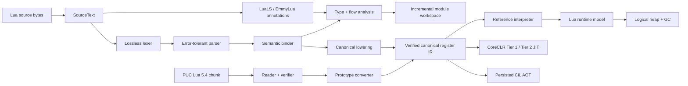

<p align="center">
  
</p>

<h1 align="center">Lunil</h1>

<p align="center">
  A correctness-first Lua 5.4 compiler and managed runtime for modern .NET.
</p>

<p align="center">
  <strong>English</strong> · <a href="README.zh-CN.md">简体中文</a>
</p>

<p align="center">
  <a href="https://github.com/dlqw/Lunil/actions/workflows/ci.yml"></a>
  <a href="https://github.com/dlqw/Lunil/releases"></a>
  <a href="LICENSE"></a>
  
  
  
</p>

Lunil is a pure C# implementation of a Lua 5.4.8 compiler pipeline and runtime.
It preserves Lua's byte-oriented source and binary-string semantics while providing
immutable syntax trees, semantic analysis, verified canonical IR, PUC Lua binary
chunk interoperability, a managed interpreter, and an explicit logical garbage
collector.

> [!IMPORTANT]
> The current source version is stable **`0.7.0`**. The `0.6.0` line ended at the
> immutable `0.6.0-alpha.14` execution-backend preview without a stable `0.6.0` release.
> Public Compiler/Hosting boundaries, the LuaLS/legacy EmmyLua annotation front end, and
> bounded type/control-flow analysis, incremental module workspace, and the `lunil` CLI are now
> available. The official Lua 5.4.8 user-mode suite and six-RID evidence pass, and all 14 public
> assemblies/packages are frozen by compatibility baselines. The accepted release candidate had
> no product-code, public-API-baseline, or package-scope changes before stable promotion.

## Table of contents

- [Why Lunil](#why-lunil)
- [Project status](#project-status)
- [Features](#features)
- [Quick start](#quick-start)
- [Using Lunil as a library](#using-lunil-as-a-library)
- [Architecture](#architecture)
- [Repository layout](#repository-layout)
- [Compatibility and platforms](#compatibility-and-platforms)
- [Packages and releases](#packages-and-releases)
- [Documentation](#documentation)
- [Contributing](#contributing)
- [Security](#security)
- [License](#license)

## Why Lunil

- **Lua fidelity first** — targets Lua 5.4.8 syntax, opcodes, number behavior,
  multiple results, varargs, coroutines, metatables, to-be-closed variables, and
  binary chunks without silently replacing Lua semantics with CLR semantics.
- **Managed and embeddable** — implemented in C# for .NET 10, with explicit runtime
  ownership, resource budgets, handles, protected errors, and host-facing APIs.
- **One verified IR** — source compilation and imported PUC Lua chunks converge on a
  shared canonical register IR with structural and control-flow verification.
- **Designed for multiple execution tiers** — the reference interpreter, persisted CIL
  AOT, profile-guided CoreCLR Tier 1/Tier 2 JIT, and guarded exact-numeric loop OSR share one
  verified execution contract; NativeAOT build integration follows the same ABI.
- **Testable by construction** — deterministic fuzzing, GC stress, malformed-input
  tests, binary round trips, and PUC Lua differential fixtures are part of the design.

## Project status

| Area | Status | Notes |
| --- | --- | --- |
| Lexer and parser | Implemented | Complete Lua 5.4 grammar, lossless trivia, bounded error recovery |
| Binding and lowering | Implemented | Locals, captures, `_ENV`, attributes, labels/gotos, verified canonical IR |
| Binary chunks | Implemented | Bounded Lua 5.4 reader/writer/verifier and PUC prototype conversion |
| Reference interpreter | Implemented | Calls, varargs, multiple results, control flow, coroutines, errors and close unwinding |
| Runtime and logical GC | Implemented | Tables, values, metatables, quotas, handles, weak tables, ephemerons and finalizers |
| Standard library | Implemented | Basic, coroutine, table, string, math, utf8, package, io, os, and debug libraries |
| JIT / AOT backends | Stable | Tier 1, exact-numeric Tier 2, and guarded exact-numeric loop OSR have six-RID rollout evidence and are enabled automatically; persisted CIL has validated collectible loading/execution and six-RID production performance gates; managed semantic fallbacks remain experimental opt-ins |
| Compiler product API | Stable `0.7` | Unified bounded lex/parse/bind/lower/verify pipeline, immutable results, phase diagnostics, cancellation boundaries, and canonical source identity |
| Hosting product API | Stable `0.7` | Reusable compile/execute host with explicit trusted, restricted, and deterministic capability profiles and runtime budgets |
| Annotation product API | Stable `0.7` | Shared bounded annotation lexer/type AST, LuaLS default parser, legacy EmmyLua compatibility, unknown-tag preservation, configurable diagnostics, and suppression |
| Type and flow analysis API | Stable `0.7` | Semantic type/pack model, annotation declarations, constraints, CFGs, function/return inference, nil/type/assert/discriminant narrowing, definite assignment, unreachable analysis, generics, source suppression, and deterministic widening budgets |
| Workspace product API | Stable `0.7` | Stable module/source identities, injectable resolvers, static/dynamic require classification, SCC fixed points, content-addressed caching, minimal invalidation, bounded parallelism, cancellation, and deterministic merging |
| CLI | Stable `0.7` | Packaged `lunil` tool with `run`/`check`/`build`/`dump`, stable exit codes, text/JSON diagnostics, stdin, response files, layered configuration, workspace resolution, resource budgets, and trusted/sandbox/deterministic profiles |
| Stability contract | Stable release | Backward-compatible fixes on this line use `0.7.1`; the next feature/API milestone is `0.8.0` |

### Current backend readiness

| Execution path | Release behavior | Readiness accepted for stable `0.7.0` |
| --- | --- | --- |
| Reference interpreter | Explicit Tier 0 and exact fallback | Implemented and used as the semantic reference |
| CoreCLR Tier 1 JIT | `Auto` for repeatedly hot, benefit-qualified functions | Qualified on all six release RIDs |
| Exact-numeric Tier 2 JIT | Automatic promotion after Tier 1 qualification | Qualified on all six release RIDs; managed semantic profiles stay on Tier 1 unless explicitly enabled |
| Exact-numeric loop OSR | Enabled by default after loop and runtime-value qualification | Qualified on all six release RIDs; non-exact loops are rejected before compilation |
| Persisted CIL AOT | Explicit artifact compile, validation, collectible load, and execution | Runtime path and production performance gates qualified on all six release RIDs |
| Build-time AOT / NativeAOT | Static registry when `Lunil.Build` is used; interpreter fallback for dynamic modules | Build and publish integration verified on all six release RIDs |

These results closed the `0.6.0-alpha.14` JIT/AOT productionization milestone and remain
regression gates for `0.7.0`. The stable release retains the frozen compiler, analysis, hosting,
CLI, conformance, and package surface described by the [0.7.0 roadmap](docs/roadmap-0.7.0.md).

## Features

### Compiler and IR

- Immutable byte-oriented `SourceText` with byte and UTF-16 diagnostic locations.
- Lossless lexer with trivia preservation and complete numeric/string decoding.
- Error-tolerant immutable syntax trees for the complete Lua 5.4 grammar.
- Lexical binding for locals, captures, `_ENV`, attributes, labels, and gotos.
- Syntax/semantic lowering into verified canonical register IR.
- A public `LuaCompiler` pipeline with bounded phase options, stable phase-attributed
  diagnostics, cancellation boundaries, immutable results, and logical source identities.
- A public LuaLS/legacy EmmyLua annotation front end with bounded lexing/type parsing,
  independent dialect parsers, compatibility resolution, unknown-tag preservation, and
  diagnostic suppression; annotations remain erased from runtime IR.
- A public `Lunil.Analysis` phase with immutable semantic types, type packs, class/alias/enum
  declarations, structural tables, overloads, generics, constraints and CFGs; flow analysis
  performs nil/type/assert/discriminant/short-circuit narrowing, definite-assignment and
  unreachable checks, return-pack inference, source suppression, and bounded widening.
- A public `Lunil.Workspace` layer with stable module/source identities, in-memory and root-confined
  file resolvers, direct-global static `require` extraction, dynamic boundaries, deterministic SCC
  fixed points, dependency-aware export types, content-addressed caches, minimal invalidation,
  global budgets, cancellation, bounded parallel scheduling, and deterministic result merging.
- Full Lua 5.4 opcode model with binary-compatible 32-bit instruction layouts.
- Bounded PUC Lua 5.4 binary chunk reading, writing, validation, and conversion.

### Runtime

- 16-byte tagged value representation and binary Lua strings.
- Heap-owned tables, closures, threads, upvalues, and native callable descriptors.
- Array plus open-addressed-hash tables with tombstones and stable `next` traversal.
- Incremental/generational tri-color logical GC with barriers, remembered sets,
  weak tables, ephemerons, finalizers, resurrection, quotas, and host handles.
- Reference interpreter with numeric-string coercion, resource budgets, tail calls,
  multiple results, varargs, and open stack windows.
- Non-recursive coroutine scheduler and resumable native continuation ABI.
- Shared type/object metatable dispatch, `pcall`/`xpcall`, and resumable `__close`
  unwinding.

### Standard library

- Complete managed Lua 5.4 basic, coroutine, table, string, math, utf8, package, io,
  os, and debug libraries, installed together with `LuaStandardLibrary.InstallAll`.
- Explicit Lua pattern VM, `string.format`, binary `pack`/`unpack`, and canonical
  IR-to-Lua 5.4 chunk generation for `string.dump`.
- Full/light userdata, registry, file userdata lifecycle, close/finalizer behavior,
  debug hooks, nested resumable callbacks, and generic-for closing values.
- Injectable filesystem, console, environment, operating-system, clock, process,
  locale, timezone, and pipe providers for deterministic or sandboxed hosts.
- Pure Lua `package` loaders are supported. Native Lua C modules remain unsupported
  because Lunil does not expose the Lua C ABI.

### Verification and quality

- Execution-grade chunk and IR verification.
- PUC Lua 5.4.8 binary/runtime differential fixtures and portable standard-library
  suites for strings, patterns, packing, math, UTF-8, files, loading, and debug behavior.
- Deterministic malformed-IR, table, GC, and coroutine fuzzing.
- GC-stress and ownership tests plus a runtime benchmark harness.
- CI on Windows, Linux, and macOS with release bundles for x64 and Arm64.

### Command-line product

- `lunil run` preflights source workspaces or executes validated PUC Lua 5.4 chunks, publishes
  main-chunk varargs and `arg`, and keeps program output separate from diagnostics.
- `lunil check` analyzes one or more roots with cross-module types; `lunil build` emits portable
  Lua 5.4 chunks or persisted CIL AOT assemblies/PDBs/manifests; `lunil dump` exposes summary,
  syntax, annotations, analysis, IR, and chunk views as text or JSON.
- Defaults, `lunil.json`, `LUNIL_*` environment variables, response files, and direct CLI options
  have defined precedence. Trusted, root-confined read-only sandbox, and deterministic profiles
  share explicit input, instruction, stack, call-depth, and heap budgets.
- The `Lunil.Cli` .NET tool package and RID bundles are smoke-tested; NativeAOT, trimmed
  single-file, and ReadyToRun CLI publications run parser/configuration/JSON/build checks in CI.

## Quick start

### Prerequisites

- [.NET SDK 10.0.103](https://dotnet.microsoft.com/download/dotnet/10.0) or a
  compatible 10.0 patch release;
- Git;
- optional: PUC Lua 5.4.8 tools for interoperability fixtures.

### Install and use the CLI

Install the tagged tool package from the configured GitHub Packages source, or run the project
directly from a checkout:

```bash
dotnet tool install --global Lunil.Cli --version 0.7.0
lunil --version

lunil run app.lua -- one two
lunil check app.lua --module-root . --warnings-as-errors
lunil build app.lua --target chunk --output app.luac
lunil build app.lua --target aot --output artifacts/aot
lunil dump app.lua --kind analysis --format json
```

Use `-` for source stdin, `@arguments.rsp` for UTF-8 response files, and `lunil.json` for project
defaults. See the [CLI reference](docs/cli.md) for configuration, profiles, diagnostics, and exit
codes.

### Build from source

```bash
git clone https://github.com/dlqw/Lunil.git
cd Lunil
dotnet restore Lunil.sln
dotnet build Lunil.sln --configuration Release --no-restore
dotnet test Lunil.sln --configuration Release --no-build --no-restore
```

Verify formatting or run the benchmark harness:

```bash
dotnet format Lunil.sln --verify-no-changes --no-restore
dotnet run --configuration Release \
  --project benchmarks/Lunil.Runtime.Benchmarks -- 1000000
```

## Using Lunil as a library

Tagged releases provide six RID bundles and publish the corresponding `Lunil.*`
NuGet and symbol packages to GitHub Packages. Projects may also be referenced directly
from a source checkout.

```xml
<PackageReference Include="Lunil.Hosting" Version="0.7.0" />
```

The high-level host compiles, verifies, installs the standard library, and executes through
one reusable state. The default profile is restricted; trusted access and deterministic
execution are explicit options:

```csharp
using Lunil.Hosting;
using Lunil.Runtime.Execution;

const string lua = """
    local total = 0
    for i = 1, 10 do
        total = total + i
    end
    return total
    """;

var host = new LuaHost(LuaHostOptions.Restricted);
var run = host.RunUtf8(lua, "@examples/sum.lua");

if (!run.CompilationSucceeded)
{
    foreach (var diagnostic in run.Compilation.Diagnostics)
    {
        Console.Error.WriteLine($"{diagnostic.Phase} {diagnostic.Code}: {diagnostic.Message}");
    }

    return;
}

if (run.Execution?.Signal != LuaVmSignal.Completed)
{
    throw new InvalidOperationException("Lua execution did not complete.");
}

Console.WriteLine(run.Execution.Values[0].AsInteger()); // 55
```

To execute a validated PUC Lua 5.4 binary chunk:

```csharp
var bytecode = File.ReadAllBytes("program.luac");
var host = new LuaHost(LuaHostOptions.Restricted);
var result = host.ExecuteBinaryChunk(bytecode);
```

The same host exposes a reusable incremental workspace without changing runtime `package` or
`require` behavior:

```csharp
using Lunil.Workspace;

using var host = new LuaHost(LuaHostOptions.Restricted);
var workspace = await host.AnalyzeWorkspaceAsync([
    LuaWorkspaceDocument.FromUtf8(
        "app",
        "local dep = require('dep')\nreturn dep.value + 1"),
    LuaWorkspaceDocument.FromUtf8("dep", "return { value = 41 }"),
]);

Console.WriteLine(workspace.GetModule("app")!.ExportedType.DisplayName); // integer
```

`LuaCompiler`, `LuaExecutor`, and the individual syntax, annotation, analysis, workspace, semantic, and IR
packages remain available to lower-level consumers. `LuaHost` is the product-level embedding
entry point; `LuaInterpreter` remains available when a host explicitly requires the Tier 0
reference backend.

`LuaJitExecutor` is the CoreCLR dynamic backend. Its release default is `Auto`: execution starts
in the interpreter and only deterministic, repeatedly hot, benefit-qualified functions are queued
for Tier 1 compilation. Exact integer, float, and mixed-numeric profiles are then automatically
promoted only when eligibility analysis guarantees `ExactNumericSpecializedCil`; table, closure,
call, upvalue, and to-be-closed profile sites remain on Tier 1. Guard failure deoptimizes exactly
to canonical execution and re-runs eligibility against the widened profile. Set
`EnableTier2=false` to disable Tier 2 profiling and profile import completely, or explicitly set
`EnableTier2ManagedFallback=true` to allow the still-experimental `ManagedProfileProgram` path.
Dynamic-code-unavailable deployments, including NativeAOT, keep exact interpreter fallback and do
not collect Tier 2 profiles.

Loop OSR is independently enabled by default, but admits only verified natural loops whose
hotness-delayed eligibility analysis guarantees
`GuardedExactNumericCil`. Before queue admission, every numeric guard site must also observe exact
integer/float operands; a non-exact or metamethod operand is permanently rejected through `JIT3105`
without compilation or guard churn. The specialized emitter is prepared lazily only after that
runtime qualification succeeds, so negative and short-loop workloads do not pay its one-time
initialization cost. Load/move, control flow, numeric-for, guarded close, and exact numeric
operations execute inside the generated loop method with canonical-PC, budget, hook/debug, GC, and
deopt guards. `EnableLoopOsrManagedFallback=true` explicitly restores the experimental managed
canonical-loop and guard-widening path. Set `EnableLoopOsr=false` for a complete opt-out from
analysis, qualification, preparation, and compilation. Dynamic-code-unavailable runtimes keep the
same complete fallback regardless of the configured default.

On CoreCLR, a persisted CIL artifact can be validated, loaded into a collectible context, and
executed through the same scheduler without reimplementing coroutine, hook, close, or exception
semantics:

```csharp
var artifact = LuaAotCompiler.Compile(lowering.Module).Artifact
    ?? throw new InvalidOperationException("Persisted CIL compilation failed.");
var loading = LuaAotArtifactLoader.Load(
    artifact,
    new LuaAotLoadOptions { ExpectedModuleContentId = artifact.Manifest.ModuleContentId });
if (!loading.Succeeded)
{
    throw new InvalidOperationException(string.Join("; ", loading.Diagnostics));
}

using var loaded = loading.Module!;
var executor = new LuaPersistedAotExecutor(loaded);
var result = executor.Execute(state, state.CreateMainClosure(lowering.Module));
```

`loading.Metrics` attributes validation, assembly loading, delegate binding, total latency, and
allocated bytes. `executor.Statistics` separates persisted-method invocations, artifact lookup
fallbacks, expected debug-mode deoptimization, and unexpected compiled deoptimization. The caller
owns `loaded`; disposing it unloads the collectible context and subsequent execution falls back at
the current canonical PC.

Untrusted source and bytecode should use bounded parser/chunk options, interpreter
instruction and stack budgets, and heap quotas appropriate for the host.

### Build-time AOT and NativeAOT

Add `Lunil.Build` and declare source or PUC Lua 5.4 chunks as `LunilCompile` items:

```xml
<ItemGroup>
  <PackageReference Include="Lunil.Build" Version="0.7.0" />
  <LunilCompile Include="Modules/math.lua"
                ModuleName="app.math"
                InputKind="Source"
                Optimization="Release"
                DebugSymbols="false"
                Sandbox="Restricted" />
</ItemGroup>
```

The package resolves all source items through the same workspace graph, reports cross-module
analysis diagnostics, verifies and compiles each module before `CoreCompile`, writes deterministic
artifacts under `obj/lunil/`, and generates a direct-method registry without runtime reflection.
A host can obtain the embedded canonical module and execute its static entry:

```csharp
if (!LuaStaticAotRegistry.TryGetModule("app.math", out var module) || module is null)
{
    throw new InvalidOperationException("The build-time module was not registered.");
}

var state = new LuaState();
var result = new LuaStaticAotExecutor().Execute(state, module.CreateMainClosure(state));
```

Set `PublishAot=true` for NativeAOT. Dynamic modules still execute through the interpreter;
JIT and dynamic PE loading are disabled when dynamic code is unavailable. See the
[NativeAOT and MSBuild guide](docs/nativeaot-build-integration.md) for metadata,
incremental-build behavior, diagnostics, and publish commands.

## Architecture



The compiler is byte-oriented at its boundaries, publishes immutable syntax, annotation,
semantic, type, and control-flow models, and lowers runtime behavior to a backend-neutral IR.
Static-analysis metadata remains erased from that IR. The runtime deliberately models Lua
objects, ownership, stacks, continuations, and logical GC independently of CLR object lifetime.
This keeps interpreter behavior explicit and gives future backends a common semantic contract.

## Repository layout

```text
Lunil/
├── src/
│   ├── Lunil.Core/              # source text, diagnostics, Lua numerics
│   ├── Lunil.Syntax/            # lexer, tokens, parser, immutable syntax
│   ├── Lunil.EmmyLua/           # LuaLS and legacy EmmyLua annotation front end
│   ├── Lunil.Analysis/          # semantic types, CFGs, constraints and flow analysis
│   ├── Lunil.Workspace/         # module graph, resolvers and incremental analysis cache
│   ├── Lunil.Semantics/         # binding and canonical lowering
│   ├── Lunil.Compiler/          # public bounded compilation pipeline and results
│   ├── Lunil.IR/                # canonical IR and Lua 5.4 binary chunks
│   ├── Lunil.Runtime/           # values, tables, GC, interpreter, coroutines
│   ├── Lunil.Hosting/           # reusable host, capability profiles and execution boundary
│   ├── Lunil.CodeGen.Cil/       # typed CIL plans, persisted AOT and tiered CoreCLR JIT
│   ├── Lunil.Build/             # MSBuild task, build assets and NativeAOT registry generation
│   ├── Lunil.Cli/               # packaged run/check/build/dump command-line product
│   └── Lunil.StandardLibrary/   # standard-library registration and modules
├── tests/                       # unit, differential, fuzz and GC-stress tests
├── benchmarks/                  # runtime benchmark harness
├── docs/                        # architecture, ABI, branching and versioning
├── scripts/                     # release bundle and NuGet packaging scripts
├── changelogs/                  # version-specific release notes
└── .github/workflows/           # CI and tag-driven release automation
```

## Compatibility and platforms

- **Language target:** Lua 5.4.8.
- **Runtime target:** .NET 10.
- **CI hosts:** Windows, Ubuntu Linux, and macOS.
- **Release RIDs:** `win-x64`, `win-arm64`, `linux-x64`, `linux-arm64`, `osx-x64`,
  and `osx-arm64`.
- **Binary chunks:** Lua 5.4 format with explicit target description and strict bounds;
  incompatible numeric representations are rejected instead of truncated.

See [compiler design](docs/compiler-design.md) for the compatibility contract and
known non-goals of the current milestone.

## Packages and releases

Lunil follows [SemVer 2.0](https://semver.org/). `X.Y.Z` and the prerelease suffix
describe different things:

| Version change | Use it for |
| --- | --- |
| `X` major | A new stable compatibility generation after `1.0.0`; increment when stable consumers must make intentional breaking migrations |
| `Y` minor | The next pre-1.0 development milestone, or a backward-compatible feature release after `1.0.0` |
| `Z` patch | Backward-compatible fixes and refinements to an already released stable `X.Y.0` line |
| `alpha.N` | Active feature/API development; incomplete behavior and breaking changes are still expected |
| `beta.N` | Feature and public-API scope frozen; compatibility, diagnostics, documentation, and performance hardening only |
| `rc.N` | A stable-release candidate; only release-blocking fixes may enter |
| no suffix | Stable release, promoted only from an accepted RC |

The `0.7.0` promotion sequence is:

```text
0.7.0-alpha.N -> 0.7.0-beta.N -> 0.7.0-rc.N -> 0.7.0
```

The current version is stable **`0.7.0`**. The `0.6.0` line was explicitly
superseded at `0.6.0-alpha.14`; its published tag remains immutable and no suffix-free
`0.6.0` will be created. Prerelease counters increase for every published build within a
channel and restart at `1` when entering a new channel. The accepted Beta entered RC, and the
accepted `0.7.0-rc.1` entered stable without product-code or frozen API/package-scope changes.
Backward-compatible fixes use `0.7.1`; new feature/API work starts at `0.8.0-alpha.1`.

An immutable `v<SemVer>` tag triggers validation, six RID bundles, symbol-enabled
NuGet packages, GitHub Packages publication, and a GitHub Release. Versions with a
suffix are automatically marked as prereleases. See the
[version policy](docs/versioning.md) for compatibility and promotion rules.

## Documentation

| Document | Description |
| --- | --- |
| [Compiler design](docs/compiler-design.md) | Architecture, compatibility contract, IR and backend design |
| [0.7.0 roadmap](docs/roadmap-0.7.0.md) | Compiler/hosting foundation, annotations, analysis, workspace, CLI and promotion gates |
| [0.7.0 API/package compatibility](docs/api-compatibility.md) | Frozen assembly APIs, NuGet assets, validation policy, and update commands |
| [CLI reference](docs/cli.md) | Commands, configuration precedence, profiles, diagnostics, artifacts, and exit codes |
| [Execution backend ABI](docs/adr/0001-execution-backend-abi-v1.md) | Frozen scheduler, PC, budget, safe-point and code-generation contract |
| [Loop OSR productionization](docs/adr/0006-loop-osr-performance-productionization.md) | Exact-numeric OSR code shape, eligibility, guards, fallback, and performance gates |
| [Loop OSR rollout evidence closure](docs/adr/0008-loop-osr-qualified-preparation-and-evidence.md) | Qualified lazy emitter preparation and balanced high-sample rollout evidence |
| [Loop OSR automatic default rollout](docs/adr/0009-loop-osr-auto-default-rollout.md) | Six-RID authorization, release default, and explicit opt-out contract |
| [Persisted CIL AOT productionization](docs/adr/0010-persisted-cil-aot-performance-productionization.md) | Collectible runtime execution, loader attribution, fallback, and six-RID performance gates |
| [Backend performance baseline](docs/backend-performance-baseline.md) | Interpreter baseline and benchmark procedure for JIT/AOT work |
| [Backend cache contract](docs/backend-cache-contract.md) | Cache keys, disk layout, profile format, quotas and corruption behavior |
| [NativeAOT and MSBuild](docs/nativeaot-build-integration.md) | `Lunil.Build`, static registries, diagnostics and publish modes |
| [Runtime continuation ABI](docs/runtime-continuation-abi.md) | Frozen continuation and yield boundary from `0.3.0` |
| [PUC prototype import](docs/puc-prototype-import.md) | PUC Lua prototype-to-canonical-IR conversion |
| [Versioning](docs/versioning.md) | SemVer, alpha/beta/RC promotion and release procedure |
| [Branch management](docs/branching.md) | Protected `main`, branch names and merge policy |
| [Changelogs](changelogs/) | Version-specific release notes |

## Contributing

Issues and focused pull requests are welcome. Create work on a `feature/*`, `fix/*`,
or `docs/*` branch, add tests and changelog entries where applicable, and run the full
build, test, and formatting commands before submitting. `main` is protected and uses
squash merges after all required checks pass.

Read [branch management](docs/branching.md) before contributing.

## Security

Please do not open a public issue for a suspected vulnerability. Use
[GitHub private vulnerability reporting](https://github.com/dlqw/Lunil/security/advisories/new)
with a minimal reproduction, affected version, and impact assessment.

## License

Lunil is licensed under the [MIT License](LICENSE).

Lua is a trademark of Lua.org, PUC-Rio. Lunil is an independent implementation and is
not affiliated with or endorsed by Lua.org or PUC-Rio.
