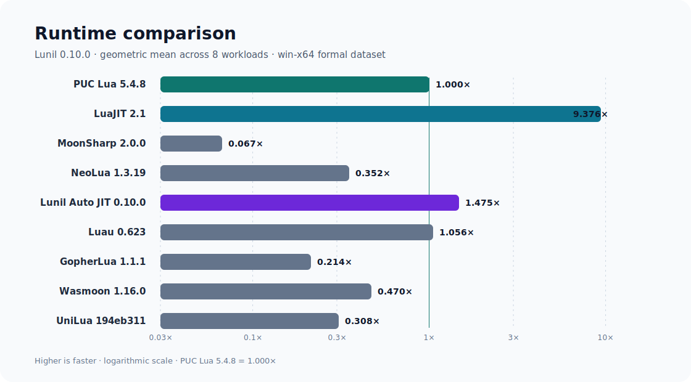
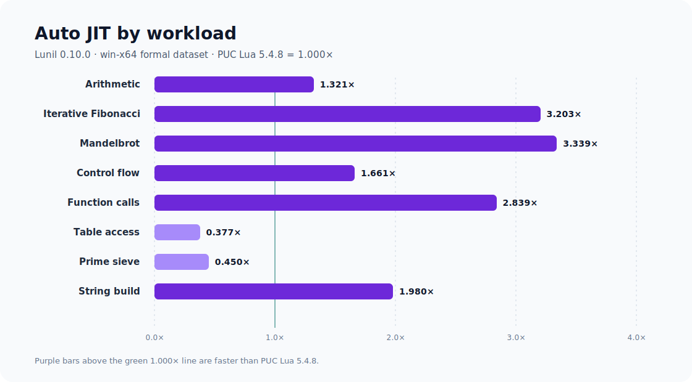
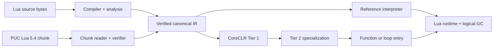

<p align="center">
  
</p>

<h1 align="center">Lunil</h1>

<p align="center">
  A correctness-first, versioned Lua compiler and managed runtime for modern .NET, with
  capability-controlled CLR interoperation.
</p>

<p align="center">
  <strong>English</strong> · <a href="README.zh-CN.md">简体中文</a>
</p>

<p align="center">
  <a href="https://github.com/dlqw/Lunil/actions/workflows/ci.yml"></a>
  <a href="https://github.com/dlqw/Lunil/releases"></a>
  <a href="LICENSE"></a>
  
  
</p>

Lunil is a pure C# versioned Lua compiler, analysis toolchain, and runtime for .NET 10. Lua 5.4.8
remains the default; the stable `0.11.0` release additionally enables explicit Lua 5.1,
Lua 5.2, Lua 5.3, and Lua 5.5 contracts. Source and versioned binary chunks converge on one verified canonical IR, then execute through a reference
interpreter or a profile-guided CoreCLR JIT. The same compiler and interpreter remain available in
.NET NativeAOT and trimmed applications.

> [!NOTE]
> Stable `0.11.0` is the supported release. It preserves Lua 5.4.8 as the default while exposing
> explicit Lua 5.1–5.5 version identities and independent PUC chunk adapters.
> The `0.11.0` source line adds an opt-in, exact-allowlist CLR type discovery and object
> construction bridge; it remains disabled unless an embedding host configures it.
> The current source tree is the `0.12.0-alpha.16` hot-update preview; it adds coordinated target
> isolation, bounded preparation backpressure, and atomic CLR callback generation fencing and is
> not the stable package line.

## Performance

The formal `0.10.0` dataset uses identical Lua source across eight workloads, six balanced rounds,
and the `win-x64` release RID. PUC Lua 5.4.8 is normalized to `1.000x`; higher is faster. Each
row identifies its semantic group so comparisons stay within compatible language contracts.

| Engine | Version | Semantic group | Geomean vs PUC Lua 5.4.8 |
| --- | --- | --- | ---: |
| LuaJIT | 2.1 (commit `3c4f9fe`) | `lua51-dialect` | 9.376x |
| **Lunil Auto JIT** | **0.10.0** | **lua54** | **1.475x** |
| Luau | 0.623 | `lua51-dialect` | 1.056x |
| PUC Lua | 5.4.8 | `lua54` | 1.000x |
| Wasmoon | 1.16.0 | `lua54` | 0.470x |
| NeoLua | 1.3.19 | `managed-dotnet` | 0.352x |
| UniLua | `194eb311` | `lua52-managed` | 0.308x |
| GopherLua | 1.1.1 | `lua51-dialect` | 0.214x |



| Auto JIT workload | Vs PUC Lua 5.4.8 |
| --- | ---: |
| Arithmetic | 1.321x |
| Iterative Fibonacci | 3.203x |
| Mandelbrot | 3.339x |
| Control flow | 1.661x |
| Function calls | 2.839x |
| Table access | 0.377x |
| Prime sieve | 0.450x |
| String build | 1.980x |



The default Auto JIT reaches `1.980x` PUC Lua 5.4.8 on the `string_build` workload. The reviewed
release values, benchmark environment, pinned reference versions, and commands are preserved in
the [machine-readable dataset](benchmarks/results/0.10.0-performance.json).

## Highlights

- **Versioned Lua fidelity** — Lua 5.4 remains the default, with explicit Lua 5.1–5.5 source and
  binary-chunk adapters in stable 0.11.0; each version has its own syntax, numeric, library,
  and chunk contract.
- **Lua 5.4 fidelity** — complete syntax, binary strings, integer/float behavior, multiple results,
  varargs, coroutines, metatables, to-be-closed variables, binary chunks, and standard libraries.
- **Verified compiler pipeline** — byte-oriented source text, lossless syntax, binding, type and
  flow analysis, workspace analysis, canonical lowering, and independent IR verification.
- **Typed analysis embedding** — the 0.12 preview adds call, member, function, parameter, and block
  facades plus extensible visitors while preserving the lossless tree as an escape hatch.
- **Stable symbol identities** — the 0.12 preview exposes serialized keys for symbols and functions
  across compilation and workspace snapshots without using source offsets or transient IDs.
- **Code intelligence indexes** — typed call sites, unresolved call retention, reference queries,
  and compilation/workspace call graphs are available without reinterpreting the generic AST.
- **Runnable analysis embedding** — a CI-executed sample covers compiler, semantics, annotations,
  CFGs, call/reference indexes, cyclic workspaces, stable identities, and cache invalidation.
- **Managed runtime** — explicit Lua values, tables, closures, threads, upvalues, resource budgets,
  protected errors, host handles, weak tables, ephemerons, finalizers, and logical GC.
- **Adaptive execution** — the default Auto JIT selects verified compiled paths when dynamic code
  is available and otherwise uses the reference interpreter.
- **Embeddable and sandboxable** — reusable hosting API with restricted, trusted, and deterministic
  capability profiles.
- **Capability-controlled CLR bridge** — the 0.11 can discover, construct, and invoke
  exact-allowlisted CLR types without loading assemblies or enabling unrestricted reflection.
- **Production hot-update preview** — signed Patch Bundles with key rotation and revocation,
  signer-authorized rollback, capability admission, signed target selection, game-loop atomic
  publication, state and resource migration, multi-State ring rollout, exclusively owned and
  compactable recovery journals, and .NET telemetry.
- **Cross-platform** — Windows, Linux, and macOS bundles for x64 and Arm64; NativeAOT and trimming
  use deterministic interpreter fallback when dynamic code is unavailable.

## CLR interoperation in 0.11.0

CLR interoperation is opt-in and fail-closed. A host must grant the required capabilities and
provide exact, case-sensitive assembly, type, member, delegate, and event allowlists; the bridge
only searches assemblies that are already loaded and never exposes unrestricted reflection.

```csharp
var options = LuaHostOptions.Restricted with
{
    Clr = new LuaClrOptions
    {
        Capabilities = LuaClrCapabilities.TypeDiscovery |
            LuaClrCapabilities.Construction | LuaClrCapabilities.MemberAccess,
        AllowedAssemblyNames = ["Example.Contracts"],
        AllowedTypeNames = ["Example.Contracts.Point"],
        AllowedMemberNames = ["Translate"],
        InstallGlobalModule = true,
    },
};
using var host = new LuaHost(options);
var result = host.RunUtf8(
    "local p = clr.new('Example.Contracts.Point', 1, 2); return p:Translate(3)");
```

The installed `clr` module provides deterministic type discovery and construction, explicit
member access and invocation, disposable event subscriptions, `Task`/`ValueTask` awaiting,
cancellation, and idempotent disposal. Allowlisted userdata also supports properties, fields,
indexers, operators, and bound method calls. Delegate conversion and event callbacks require
separate allowlists and preserve Lua state ownership. See the [CLR interoperation guide](docs/clr-interop.md)
for conversion, overload, NativeAOT, trimming, and deployment details.

Native Lua C modules are not supported because Lunil does not expose the Lua C ABI.

## Typed syntax analysis in 0.12 preview

Typed facades remove grammar-shape and child-order assumptions from common source analysis. The
walker below finds constant UTF-8 `require` requests, including parenthesized and shorthand string
calls. `IsComplete` is false when a facade contains recovery nodes or missing tokens; `Node` always
provides the underlying lossless syntax for advanced handling.

```csharp
using Lunil.Core.Text;
using Lunil.Syntax.Parsing;

var syntax = LuaParser.Parse(SourceText.FromUtf8("local m = require 'game.player'"));
var walker = new RequireWalker(syntax.Source);
walker.Visit(syntax.Root);

sealed class RequireWalker(SourceText source) : LuaSyntaxWalker
{
    public override void VisitCallExpression(LuaCallExpressionSyntax call)
    {
        if (!call.IsMethodCall &&
            call.Callee?.TryGetIdentifierToken(out var identifier) == true &&
            identifier.GetText(source) == "require" &&
            call.Arguments.FirstOrDefault()?.TryGetConstantString(out var module) == true)
        {
            Console.WriteLine(module);
        }

        base.VisitCallExpression(call);
    }
}
```


## Stable symbol keys in 0.12 preview

Use a logical module name—not an absolute host path—when persisting symbol or function keys. The
serialized value can be stored and reconstructed in a later snapshot. Whitespace, comments, and
unrelated declarations do not change named keys; renames, module changes, and lexical-owner changes
are allowed to produce new keys. Annotation declarations use the same canonical format through
`LuaCompilationResult.GetAnnotationKey`.

```csharp
using System.Linq;
using Lunil.Compiler;
using Lunil.Semantics.Binding;

var moduleName = "game/player";
var compilation = new LuaCompiler().CompileUtf8(
    "local health = 100",
    sourceName: "game/player.lua");
var semanticModel = compilation.SemanticModel;
var symbol = semanticModel.Symbols.Single(symbol => symbol.Name == "health");
var key = semanticModel.GetSymbolKey(symbol, moduleName);
var persisted = new LuaSymbolKey(key.Value);
var current = semanticModel.ResolveSymbolKey(persisted, moduleName);
```

## Call graph and reference queries in 0.12 preview

`LuaAnalysisResult.CallGraph` retains resolved, dynamic, unresolved, and unreachable call sites.
Each edge includes its containing function, callee and receiver types, direct symbol/name, optional
module request, and a statically resolved function target when one exists. Reference queries preserve
local/upvalue identity and provide a separate name-based path for implicit `_ENV` globals.

```csharp
using System.Linq;
using Lunil.Compiler;

var compilation = new LuaCompiler().CompileUtf8("""
    local function tick() return 1 end
    return tick()
    """);
var tick = compilation.SemanticModel.Symbols.Single(symbol => symbol.Name == "tick");
var references = compilation.SemanticModel.FindReferences(tick);
var call = compilation.Analysis.CallGraph.Edges.Single();
```

For a completed `LuaWorkspaceResult`, `FindReferences(LuaSymbolKey)`,
`FindGlobalReferences(string)`, and `GetCallGraph()` add module/source identities, stable function
keys, and conservative module-export targets. Reassigned module aliases are not reported as static
module targets.

The [static analysis embedding guide](docs/static-analysis-embedding.md) and its
[executable sample](samples/Lunil.StaticAnalysis.Embedding/EmbeddingScenario.cs) cover UTF-8 byte
spans versus UTF-16 editor positions, diagnostic phases, stable snapshot identities, CFGs,
workspace cycles, cache invalidation, lifetime, concurrency, and production budgets.

## Quick start

### Requirements

- [.NET SDK 10.0.103](https://dotnet.microsoft.com/download/dotnet/10.0) or a compatible .NET 10
  patch release;
- Git when building from source.

### CLI

Install stable `0.11.0` from the configured GitHub Packages source, or run from a checkout:

```bash
dotnet tool install --global Lunil.Cli --version 0.11.0
lunil --version

lunil run app.lua -- one two
lunil check app.lua --module-root . --warnings-as-errors
lunil build app.lua --target chunk --output app.luac
lunil dump app.lua --kind analysis --format json
```

Use `-` for source stdin, `@arguments.rsp` for UTF-8 response files, and `lunil.json` for project
defaults. See the [CLI reference](docs/cli.md) for commands, profiles, diagnostics, and exit codes.

### Build from source

```bash
git clone https://github.com/dlqw/Lunil.git
cd Lunil
dotnet restore Lunil.sln
dotnet build Lunil.sln --configuration Release --no-restore
dotnet test Lunil.sln --configuration Release --no-build --no-restore
```

## Embed Lunil

Reference the stable hosting package:

```xml
<PackageReference Include="Lunil.Hosting" Version="0.11.0" />
```

Compile and execute through a reusable restricted host:

```csharp
using Lunil.Hosting;
using Lunil.Runtime.Execution;

const string lua = """
    local total = 0
    for i = 1, 10 do
        total = total + i
    end
    return total
    """;

using var host = new LuaHost(LuaHostOptions.Restricted);
var run = host.RunUtf8(lua, "@examples/sum.lua");

if (!run.CompilationSucceeded)
{
    foreach (var diagnostic in run.Compilation.Diagnostics)
    {
        Console.Error.WriteLine($"{diagnostic.Phase} {diagnostic.Code}: {diagnostic.Message}");
    }
    return;
}

if (run.Execution?.Signal != LuaVmSignal.Completed)
{
    throw new InvalidOperationException("Lua execution did not complete.");
}

Console.WriteLine(run.Execution.Values[0].AsInteger()); // 55
```

`LuaHostOptions.ExecutionBackend` can require the interpreter or dynamic JIT. The default `Auto`
policy uses the verified JIT when dynamic code is available and the reference interpreter
otherwise. Lower-level compiler, syntax, analysis, workspace, IR, runtime, and standard-library
packages are also available independently.

## Architecture



All execution paths share canonical program counters, exact instruction accounting, resource
budgets, safe points, debug behavior, invalidation, and fallback semantics.

## Compatibility

- Language target: Lua 5.4.8 by default; explicit Lua 5.1–5.5 targets are available in the
  stable `0.11.0` release.
- Runtime target: .NET 10.
- Release RIDs: `win-x64`, `win-arm64`, `linux-x64`, `linux-arm64`, `osx-x64`, `osx-arm64`.
- Binary chunks: bounded Lua 5.4 format with explicit target validation; incompatible numeric
  layouts are rejected rather than truncated.
- Stable line: `0.11.x` (current release `0.11.0`); `0.10.x` remains compatible for existing hosts.
- Preview source line: `0.12.0-alpha.5`; its reviewed API snapshot may grow before the stable
  `0.12.0` freeze.

Compatibility changes and deployment notes are documented in the [0.11.0 migration guide](docs/migration-0.11.0.md).
.NET NativeAOT remains supported as a host deployment mode; see [.NET NativeAOT and trimming](docs/nativeaot-build-integration.md).

## Documentation

| Document | Purpose |
| --- | --- |
| [CLR interoperation](docs/clr-interop.md) | Allowlist configuration, construction, conversion, ownership, and deployment |
| [Signed patch bundles](docs/hot-update.md) | Patch trust, target isolation and quiescence, game-loop safe points, multi-State ring rollout, durable recovery journals, and CLI workflows |
| [CLI reference](docs/cli.md) | Commands, configuration, profiles, diagnostics, and exit codes |
| [.NET NativeAOT and trimming](docs/nativeaot-build-integration.md) | Host integration, trimming annotations, and publish verification |
| [PUC Lua prototype import](docs/puc-prototype-import.md) | Importing validated PUC Lua 5.4 binary prototypes |
| [Changelogs](changelogs/) | Community-facing release notes by version |

## Contributing

Issues and focused pull requests are welcome. Work on a `feature/*`, `perf/*`, `fix/*`, or `docs/*`
branch,
add tests appropriate to the impact, and run build, tests, formatting, and relevant documentation
checks before requesting review.

## Security

Please report suspected vulnerabilities through
[GitHub private vulnerability reporting](https://github.com/dlqw/Lunil/security/advisories/new),
not a public issue.

## License

Lunil is licensed under the [MIT License](LICENSE).
