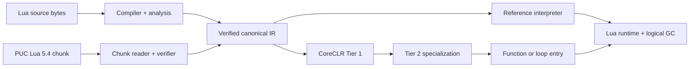

<p align="center">
  
</p>

<h1 align="center">Lunil</h1>

<p align="center">
  A correctness-first Lua 5.4 compiler and managed runtime for modern .NET.
</p>

<p align="center">
  <strong>English</strong> · <a href="README.zh-CN.md">简体中文</a>
</p>

<p align="center">
  <a href="https://github.com/dlqw/Lunil/actions/workflows/ci.yml"></a>
  <a href="https://github.com/dlqw/Lunil/releases"></a>
  
  <a href="LICENSE"></a>
  
  
</p>

Lunil is a pure C# Lua 5.4.8 compiler, analysis toolchain, and runtime for .NET 10. Source and PUC
Lua binary chunks converge on one verified canonical IR, then execute through a reference
interpreter or a profile-guided CoreCLR JIT. The same compiler and interpreter remain available in
.NET NativeAOT and trimmed applications.

> [!NOTE]
> Stable `0.8.0` is the supported release and benchmark baseline. The current source is
> `0.9.0-alpha.2`; Alpha builds may change API and backend behavior before feature freeze.

## Performance

The stable `0.8.0` report uses identical Lua source across eight workloads, six balanced rounds,
and all six release RIDs. Native PUC Lua 5.4.8 is normalized to `1.000x`; higher is faster.

| Engine | Geomean vs native Lua | Geomean vs MoonSharp |
| --- | ---: | ---: |
| LuaJIT | 11.488x | 168.397x |
| Native Lua 5.4 | 1.000x | 14.657x |
| Lunil Tier 2 | 0.682x | 9.988x |
| **Lunil Auto JIT** | **0.680x** | **9.974x** |
| Lunil Loop OSR | 0.113x | 1.659x |
| Lunil Tier 1 | 0.105x | 1.543x |
| MoonSharp | 0.068x | 1.000x |
| Lunil interpreter | 0.050x | 0.726x |


| Auto JIT workload | Vs native Lua | Vs MoonSharp |
| --- | ---: | ---: |
| Arithmetic | 1.110x | 24.659x |
| Iterative Fibonacci | 2.801x | 40.813x |
| Mandelbrot | 0.559x | 8.757x |
| Control flow | 2.070x | 34.874x |
| Function calls | 1.204x | 17.133x |
| Table access | 0.299x | 8.348x |
| Prime sieve | 0.059x | 1.464x |
| String build | 0.591x | 1.521x |


The current `0.9.0-alpha.2` source passes the same six-RID cross-runtime matrix and the complete
backend correctness, NativeAOT, route, telemetry, startup, allocation, and code-size qualification:

| Source | Auto vs native Lua | Auto vs MoonSharp | Tier 2 compile allocation p95 | Loop OSR compile allocation p95 |
| --- | ---: | ---: | ---: | ---: |
| Stable `0.8.0` | 0.680x | 9.974x | 317,776 B | 259,232 B |
| `0.9.0-alpha.2` | 0.697x | 9.918x | 250,912 B | 191,416 B |

Throughput rows are independent six-RID qualification runs, not a paired hardware claim. The
machine-readable Alpha 2 report also includes compile p95, allocation growth, startup, and
unchanged-route regression ratios.

See [Performance](docs/performance.md) for methodology, source data, confidence gates, and
reproduction commands. The [0.9.0 roadmap](docs/roadmap-0.9.0.md) defines the next performance
targets.

## Highlights

- **Lua 5.4 fidelity** — complete syntax, binary strings, integer/float behavior, multiple results,
  varargs, coroutines, metatables, to-be-closed variables, binary chunks, and standard libraries.
- **Verified compiler pipeline** — byte-oriented source text, lossless syntax, binding, type and
  flow analysis, workspace analysis, canonical lowering, and independent IR verification.
- **Managed runtime** — explicit Lua values, tables, closures, threads, upvalues, resource budgets,
  protected errors, host handles, weak tables, ephemerons, finalizers, and logical GC.
- **Tiered execution** — reference interpreter, benefit-qualified Tier 1, guarded Tier 2, and
  loop-backedge entry over the same specialization contract.
- **Embeddable and sandboxable** — reusable hosting API with restricted, trusted, and deterministic
  capability profiles.
- **Cross-platform** — Windows, Linux, and macOS bundles for x64 and Arm64; NativeAOT and trimming
  use deterministic interpreter fallback when dynamic code is unavailable.

Native Lua C modules are not supported because Lunil does not expose the Lua C ABI.

## Quick start

### Requirements

- [.NET SDK 10.0.103](https://dotnet.microsoft.com/download/dotnet/10.0) or a compatible .NET 10
  patch release;
- Git when building from source.

### CLI

Install stable `0.8.0` from the configured GitHub Packages source, or run from a checkout:

```bash
dotnet tool install --global Lunil.Cli --version 0.8.0
lunil --version

lunil run app.lua -- one two
lunil check app.lua --module-root . --warnings-as-errors
lunil build app.lua --target chunk --output app.luac
lunil dump app.lua --kind analysis --format json
```

Use `-` for source stdin, `@arguments.rsp` for UTF-8 response files, and `lunil.json` for project
defaults. See the [CLI reference](docs/cli.md) for commands, profiles, diagnostics, and exit codes.

### Build from source

```bash
git clone https://github.com/dlqw/Lunil.git
cd Lunil
dotnet restore Lunil.sln
dotnet build Lunil.sln --configuration Release --no-restore
dotnet test Lunil.sln --configuration Release --no-build --no-restore
```

## Embed Lunil

Reference the stable hosting package:

```xml
<PackageReference Include="Lunil.Hosting" Version="0.8.0" />
```

Compile and execute through a reusable restricted host:

```csharp
using Lunil.Hosting;
using Lunil.Runtime.Execution;

const string lua = """
    local total = 0
    for i = 1, 10 do
        total = total + i
    end
    return total
    """;

using var host = new LuaHost(LuaHostOptions.Restricted);
var run = host.RunUtf8(lua, "@examples/sum.lua");

if (!run.CompilationSucceeded)
{
    foreach (var diagnostic in run.Compilation.Diagnostics)
    {
        Console.Error.WriteLine($"{diagnostic.Phase} {diagnostic.Code}: {diagnostic.Message}");
    }
    return;
}

if (run.Execution?.Signal != LuaVmSignal.Completed)
{
    throw new InvalidOperationException("Lua execution did not complete.");
}

Console.WriteLine(run.Execution.Values[0].AsInteger()); // 55
```

`LuaHostOptions.ExecutionBackend` can require the interpreter or dynamic JIT. The default `Auto`
policy uses the qualified JIT when dynamic code is available and the reference interpreter
otherwise. Lower-level compiler, syntax, analysis, workspace, IR, runtime, and standard-library
packages are also available independently.

## Architecture



All execution paths share canonical program counters, exact instruction accounting, resource
budgets, safe points, debug behavior, invalidation, and fallback semantics. See
[Compiler design](docs/compiler-design.md) for the complete architecture.

## Compatibility

- Language target: Lua 5.4.8.
- Runtime target: .NET 10.
- Release RIDs: `win-x64`, `win-arm64`, `linux-x64`, `linux-arm64`, `osx-x64`, `osx-arm64`.
- Binary chunks: bounded Lua 5.4 format with explicit target validation; incompatible numeric
  layouts are rejected rather than truncated.
- Stable line: `0.8.x`; active development line: `0.9.0-alpha.N`.

Breaking changes from `0.7.0`, including the removal of Lua persisted/static AOT, are documented in
the [0.8.0 migration guide](docs/migration-0.8.0.md). .NET NativeAOT remains supported as a host
deployment mode; see [.NET NativeAOT and trimming](docs/nativeaot-build-integration.md).

## Documentation

| Document | Purpose |
| --- | --- |
| [Performance](docs/performance.md) | Current benchmark data, charts, methodology, and reproduction |
| [0.9.0 roadmap](docs/roadmap-0.9.0.md) | Performance targets, delivery stages, and release gates |
| [Compiler design](docs/compiler-design.md) | Compiler, IR, runtime, and execution architecture |
| [CLI reference](docs/cli.md) | Commands, configuration, profiles, diagnostics, and exit codes |
| [API compatibility](docs/api-compatibility.md) | Versioned public API and package baselines |
| [Versioning](docs/versioning.md) | Compatibility lines and release channels |
| [Changelogs](changelogs/) | Community-facing release notes by version |

## Contributing

Issues and focused pull requests are welcome. Work on a `feature/*`, `perf/*`, `fix/*`, or `docs/*`
branch,
add tests appropriate to the impact, and run build, tests, formatting, and relevant documentation
checks before requesting review. See [Branch management](docs/branching.md).

## Security

Please report suspected vulnerabilities through
[GitHub private vulnerability reporting](https://github.com/dlqw/Lunil/security/advisories/new),
not a public issue.

## License

Lunil is licensed under the [MIT License](LICENSE).
