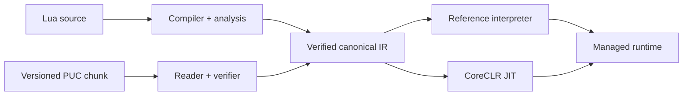

<p align="center">
  
</p>

<h1 align="center">Lunil</h1>

<p align="center">
  A correctness-first, versioned Lua compiler, analysis toolchain, and managed runtime for .NET.
</p>

<p align="center">
  <strong>English</strong> · <a href="README.zh-CN.md">简体中文</a>
</p>

<p align="center">
  <a href="https://github.com/dlqw/Lunil/actions/workflows/ci.yml"></a>
  <a href="https://github.com/dlqw/Lunil/releases/tag/v0.12.1"></a>
  <a href="LICENSE"></a>
  
  
</p>

Lunil compiles Lua source and versioned PUC Lua binary chunks into one verified canonical IR. The
same IR runs through a reference interpreter or a profile-guided CoreCLR JIT. Lua 5.4.8 is the
default language contract; explicit Lua 5.1, 5.2, 5.3, and 5.5 contracts are also available.

> [!NOTE]
> `0.12.1` is the current stable release and targets .NET 10. NativeAOT and trimmed applications use
> the interpreter when dynamic code is unavailable.

## What Lunil provides

- **Versioned Lua behavior** — source parsing, standard libraries, runtime semantics, and binary
  chunks follow the selected Lua 5.1–5.5 contract.
- **Verified compilation** — lossless UTF-8 syntax, binding, type and flow analysis, canonical
  lowering, and independent IR verification.
- **Code intelligence** — typed syntax facades, annotations, stable symbol/function keys,
  references, control-flow graphs, call graphs, and reusable workspaces.
- **Managed execution** — explicit Lua values, tables, closures, coroutines, resource budgets,
  logical GC, an interpreter, and an adaptive JIT.
- **Controlled embedding** — trusted, restricted, and deterministic host profiles plus a
  capability-controlled, exact-allowlist CLR bridge.
- **Production updates** — signed patch bundles, atomic game-loop publication, state/resource
  migration, multi-State rollouts, and durable recovery journals.
- **Portable deployment** — release bundles for Windows, Linux, and macOS on x64 and Arm64, with
  .NET NativeAOT and trimming support.

Lunil does not expose the Lua C ABI, so native Lua C modules are not supported.

## Quick start

### Run the CLI

Install the [.NET SDK 10.0.103](https://dotnet.microsoft.com/download/dotnet/10.0), or a compatible
.NET 10 patch release. Then download the archive for your RID from the
[Lunil 0.12.1 release](https://github.com/dlqw/Lunil/releases/tag/v0.12.1), extract it, and run:

```bash
./lunil --version
./lunil run app.lua -- one two
./lunil check app.lua --module-root . --warnings-as-errors
./lunil build app.lua --target chunk --output app.luac
./lunil dump app.lua --kind analysis --format json
```

On Windows, use `lunil.exe`. If GitHub Packages is already configured as a NuGet source, the CLI is
also available as a .NET tool:

```bash
dotnet tool install --global Lunil.Cli --version 0.12.1
lunil --version
```

Use `-` for source stdin, `@arguments.rsp` for UTF-8 response files, and `lunil.json` for project
defaults. See the [command-line reference](docs/cli.pub.md) for all commands and options.

### Embed the runtime

Reference `Lunil.Hosting` `0.12.1` from your configured package source or a downloaded release
package:

```xml
<PackageReference Include="Lunil.Hosting" Version="0.12.1" />
```

Compile and execute through a reusable restricted host:

```csharp
using Lunil.Hosting;
using Lunil.Runtime.Execution;

using var host = new LuaHost(LuaHostOptions.Restricted);
var run = host.RunUtf8("return 40 + 2", "@examples/answer.lua");

if (!run.CompilationSucceeded)
{
    foreach (var diagnostic in run.Compilation.Diagnostics)
    {
        Console.Error.WriteLine($"{diagnostic.Code}: {diagnostic.Message}");
    }
    return;
}

if (run.Execution?.Signal != LuaVmSignal.Completed)
{
    throw new InvalidOperationException("Lua execution did not complete.");
}

Console.WriteLine(run.Execution.Values[0].AsInteger()); // 42
```

`LuaHostOptions.ExecutionBackend` selects `Auto`, `Interpreter`, or `Jit`. `Auto` uses the verified
JIT when dynamic code is available and the reference interpreter otherwise.

### Build from source

```bash
git clone https://github.com/dlqw/Lunil.git
cd Lunil
dotnet restore Lunil.sln
dotnet build Lunil.sln --configuration Release --no-restore
dotnet test Lunil.sln --configuration Release --no-build --no-restore
```

## Execution model


```mermaid
flowchart LR
    Source[Lua source] --> Compiler[Compiler + analysis]
    Chunk[Versioned PUC chunk] --> Reader[Reader + verifier]
    Compiler --> IR[Verified canonical IR]
    Reader --> IR
    IR --> Interpreter[Reference interpreter]
    IR --> JIT[CoreCLR JIT]
    Interpreter --> Runtime[Managed runtime]
    JIT --> Runtime
```

Interpreter and JIT execution share canonical program counters, instruction accounting, resource
budgets, safe points, invalidation, and fallback semantics.

## Compatibility

| Surface | Supported contract |
| --- | --- |
| Stable release | `0.12.1` |
| Language | Lua 5.4.8 by default; explicit Lua 5.1–5.5 targets |
| Runtime | .NET 10 |
| Release RIDs | `win-x64`, `win-arm64`, `linux-x64`, `linux-arm64`, `osx-x64`, `osx-arm64` |
| Binary chunks | Version-specific, bounded PUC formats with structural and target validation |
| Dynamic code unavailable | Compiler, analysis, standard libraries, and interpreter remain available |

## Performance snapshot

The published `0.10.0` `win-x64` dataset runs identical Lua source across eight workloads and six
balanced rounds. PUC Lua 5.4.8 is normalized to `1.000x`; higher is faster.

| Comparison | Geomean throughput ratio |
| --- | ---: |
| **Lunil Auto JIT 0.10.0 / MoonSharp 2.0.0** | **21.796x** |
| Lunil Auto JIT 0.10.0 / PUC Lua 5.4.8 | 1.475x |

Results, pinned engine versions, environment details, and commands are in the
[machine-readable dataset](benchmarks/results/0.10.0-performance.json).


## Documentation

| Document | Type | Purpose |
| --- | --- | --- |
| [Command-line reference](docs/cli.pub.md) | Reference | Commands, configuration, profiles, diagnostics, and exit codes |
| [Configure CLR interoperation](docs/clr-interop.pub.md) | How-to | Allowlist setup, callbacks, timers, stable resources, and deployment |
| [CLR interoperation reference](docs/clr-interop-reference.pub.md) | Reference | Lua functions, conversions, policies, gauges, limits, and ownership contracts |
| [CLR bridge lifecycles](docs/clr-interop-lifecycle.pub.md) | Explanation | Capability boundaries, state ownership, async admission, and generation fencing |
| [Deploy signed patch bundles](docs/hot-update.pub.md) | How-to | Bundle creation, preparation, publication, migration, rollout, and recovery |
| [Signed patch bundle reference](docs/hot-update-reference.pub.md) | Reference | Manifest, trust, replay, migration, limits, statuses, stores, and telemetry |
| [Hot-update publication](docs/hot-update-lifecycle.pub.md) | Explanation | Atomic publication, identity migration, generations, rings, and durability |
| [Embed static analysis](docs/static-analysis-embedding.pub.md) | How-to | Syntax, semantic data, stable keys, CFGs, call graphs, and workspaces |
| [Publish with NativeAOT and trimming](docs/nativeaot-build-integration.pub.md) | How-to | Interpreter fallback, SDK publishing, and metadata preservation |
| [Import PUC Lua 5.4 prototypes](docs/puc-prototype-import.pub.md) | How-to | Validated binary-chunk conversion to canonical IR |
| [Migration guides](docs/migration-0.11.0.pub.md) | How-to | Historical changes for [0.8.0](docs/migration-0.8.0.pub.md), [0.10.0](docs/migration-0.10.0.pub.md), and 0.11.0 |

Every guide has an English and Simplified Chinese counterpart linked at the top of the page.

## Security

Report suspected vulnerabilities through
[GitHub private vulnerability reporting](https://github.com/dlqw/Lunil/security/advisories/new),
not a public issue.
