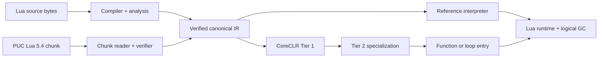

<p align="center">
  
</p>

<h1 align="center">Lunil</h1>

<p align="center">
  面向现代 .NET、正确性优先的 Lua 5.4 编译器与托管运行时。
</p>

<p align="center">
  <a href="README.md">English</a> · <strong>简体中文</strong>
</p>

<p align="center">
  <a href="https://github.com/dlqw/Lunil/actions/workflows/ci.yml"></a>
  <a href="https://github.com/dlqw/Lunil/releases"></a>
  <a href="LICENSE"></a>
  
  
</p>

Lunil 是使用纯 C# 实现的 Lua 5.4.8 编译器、分析工具链与 .NET 10 运行时。源码和 PUC Lua
二进制 chunk 会汇入同一个经过验证的 canonical IR，再通过参考解释器或基于 profile 的 CoreCLR
JIT 执行；.NET NativeAOT 与 trimming 应用仍可使用相同编译器和解释器。

> [!NOTE]
> 稳定版 `0.9.0` 是当前支持版本与性能基线。本版本保持 Lua 5.4.8 语义，并通过六个发布 RID
> 的资格门禁。

## 性能

`0.9.0` 的发布资格测量使用完全相同的 Lua 源码，在八个 workload、六轮平衡采样和全部六个发布 RID
上测试。原生 PUC Lua 5.4.8 归一化为 `1.000x`，数值越高越快。

| 引擎 | 相对原生 Lua 几何均值 | 相对 MoonSharp 几何均值 |
| --- | ---: | ---: |
| LuaJIT | 11.518x | 164.301x |
| 原生 Lua 5.4 | 1.000x | 14.287x |
| Lunil Tier 2 | 1.702x | 24.314x |
| **Lunil Auto JIT** | **1.688x** | **24.089x** |
| Lunil Loop OSR | 0.157x | 2.238x |
| Lunil Tier 1 | 0.106x | 1.504x |
| MoonSharp | 0.070x | 1.000x |
| Lunil 解释器 | 0.051x | 0.725x |


| Auto JIT workload | 相对原生 Lua | 相对 MoonSharp |
| --- | ---: | ---: |
| 算术循环 | 1.643x | 36.094x |
| 迭代 Fibonacci | 3.232x | 46.988x |
| Mandelbrot | 4.210x | 63.829x |
| 控制流 | 2.101x | 34.773x |
| 函数调用 | 2.568x | 35.421x |
| 表访问 | 0.478x | 12.467x |
| 素数筛 | 0.530x | 12.698x |
| 字符串构建 | 2.164x | 5.372x |


稳定版让稳定的字符串-数字拼接与密集字符串数组写入留在同一个带守卫 Tier 2 区域内。分段证据
没有证明需要新增密集 `table.concat` 批量复制路径；沿用现有 concat 实现时，完整 `string_build`
workload 已达到原生 Lua 的 `2.164x`。下表来自各版本独立的六 RID 资格测试，不代表同机器配对增幅。

| 版本 | Auto 总体 | 控制流 | 字符串构建 |
| --- | ---: | ---: | ---: |
| 稳定版 `0.8.0` | 0.680x | 2.070x | 0.591x |
| `0.9.0-alpha.4` | 1.326x | 1.937x | 0.592x |
| `0.9.0-alpha.5` | 1.688x | 2.101x | 2.164x |
| **`0.9.0`** | **1.688x** | **2.101x** | **2.164x** |

已接受源码完成了 Beta 资格矩阵：全部路线图目标、后端成本、conformance/differential、NativeAOT、
trimming、包/API、路由、telemetry、启动、分配和 code-size 门禁均通过。
[机器可读报告](benchmarks/results/0.9.0-performance.json)记录了精确值、产品提交和已通过的
workflow run。

测试方法、源数据、置信门禁与复现命令见[性能文档](docs/performance.md)；下一阶段量化目标见
[`0.9.0` 路线图](docs/roadmap-0.9.0.md)。

## 主要能力

- **Lua 5.4 语义**：完整语法、二进制字符串、整数/浮点行为、多返回值、vararg、coroutine、
  metatable、to-be-closed 变量、binary chunk 与标准库。
- **经过验证的编译管线**：byte-oriented source text、无损语法树、绑定、类型与流分析、workspace
  分析、canonical lowering 与独立 IR 验证。
- **托管运行时**：显式 Lua value、table、closure、thread、upvalue、资源预算、protected error、
  host handle、弱表、ephemeron、finalizer 与逻辑 GC。
- **分级执行**：参考解释器、经过收益资格检查的 Tier 1 和带守卫的 Tier 2。Loop OSR 是把运行中
  的循环通过回边切入同一专用代码的入口机制，而不是额外的执行级别。
- **可嵌入与可沙箱化**：可复用 Hosting API，提供 Restricted、Trusted 与 Deterministic 能力配置。
- **跨平台**：Windows、Linux、macOS 的 x64/Arm64 bundle；动态代码不可用时 NativeAOT 与 trimming
  会确定性回退解释器。

由于 Lunil 不公开 Lua C ABI，因此不支持原生 Lua C module。

## 快速开始

### 环境要求

- [.NET SDK 10.0.103](https://dotnet.microsoft.com/download/dotnet/10.0) 或兼容的 .NET 10 patch；
- 从源码构建时需要 Git。

### CLI

从已配置的 GitHub Packages source 安装稳定版 `0.8.0`，或直接在源码 checkout 中运行：

```bash
dotnet tool install --global Lunil.Cli --version 0.8.0
lunil --version

lunil run app.lua -- one two
lunil check app.lua --module-root . --warnings-as-errors
lunil build app.lua --target chunk --output app.luac
lunil dump app.lua --kind analysis --format json
```

使用 `-` 读取 stdin 源码，使用 `@arguments.rsp` 读取 UTF-8 响应文件，并通过 `lunil.json` 保存项目
默认值。命令、profile、诊断与退出码见 [CLI 参考](docs/cli.md)。

### 从源码构建

```bash
git clone https://github.com/dlqw/Lunil.git
cd Lunil
dotnet restore Lunil.sln
dotnet build Lunil.sln --configuration Release --no-restore
dotnet test Lunil.sln --configuration Release --no-build --no-restore
```

## 嵌入 Lunil

引用稳定版 Hosting package：

```xml
<PackageReference Include="Lunil.Hosting" Version="0.9.0" />
```

通过可复用的 Restricted host 编译并执行：

```csharp
using Lunil.Hosting;
using Lunil.Runtime.Execution;

const string lua = """
    local total = 0
    for i = 1, 10 do
        total = total + i
    end
    return total
    """;

using var host = new LuaHost(LuaHostOptions.Restricted);
var run = host.RunUtf8(lua, "@examples/sum.lua");

if (!run.CompilationSucceeded)
{
    foreach (var diagnostic in run.Compilation.Diagnostics)
    {
        Console.Error.WriteLine($"{diagnostic.Phase} {diagnostic.Code}: {diagnostic.Message}");
    }
    return;
}

if (run.Execution?.Signal != LuaVmSignal.Completed)
{
    throw new InvalidOperationException("Lua 执行未完成。");
}

Console.WriteLine(run.Execution.Values[0].AsInteger()); // 55
```

可通过 `LuaHostOptions.ExecutionBackend` 强制解释器或动态 JIT。默认 `Auto` 在动态代码可用时使用
合格 JIT，否则使用参考解释器。Compiler、Syntax、Analysis、Workspace、IR、Runtime 与标准库 package
也可独立使用。

## 架构



所有执行路径共享 canonical PC、精确指令计数、资源预算、safe point、debug 行为、失效与 fallback
语义。完整架构见[编译器设计](docs/compiler-design.md)。

## 兼容性

- 语言目标：Lua 5.4.8。
- 运行时目标：.NET 10。
- 发布 RID：`win-x64`、`win-arm64`、`linux-x64`、`linux-arm64`、`osx-x64`、`osx-arm64`。
- Binary chunk：有界 Lua 5.4 格式与显式目标校验；不兼容的数值布局会被拒绝，而不是截断。
- 稳定线：`0.9.x`；下一条开发线将在启动时另行记录。

兼容性变更和部署说明见 [`0.8.0` 迁移指南](docs/migration-0.8.0.md)。.NET NativeAOT 仍是受支持的宿主发布方式，详见
[.NET NativeAOT 与 trimming](docs/nativeaot-build-integration.md)。

## 文档

| 文档 | 内容 |
| --- | --- |
| [性能](docs/performance.md) | 当前测试数据、图表、方法与复现方式 |
| [`0.9.0` 路线图](docs/roadmap-0.9.0.md) | 性能目标、交付阶段与发布门禁 |
| [编译器设计](docs/compiler-design.md) | 编译器、IR、运行时与执行架构 |
| [CLI 参考](docs/cli.md) | 命令、配置、profile、诊断与退出码 |
| [API 兼容性](docs/api-compatibility.md) | 版本化公共 API 与 package baseline |
| [版本策略](docs/versioning.md) | 兼容性版本线与发布通道 |
| [更新日志](changelogs/) | 按版本组织的社区发布说明 |

## 参与贡献

欢迎提交 issue 和范围明确的 pull request。请在 `feature/*`、`perf/*`、`fix/*` 或 `docs/*` 分支上
开发，按影响
补充测试，并在请求审核前运行 build、test、format 与相关文档检查。详见[分支管理](docs/branching.md)。

## 安全问题

疑似安全漏洞请通过 [GitHub 私密漏洞报告](https://github.com/dlqw/Lunil/security/advisories/new)
提交，不要创建公开 issue。

## 许可证

Lunil 使用 [MIT License](LICENSE)。
