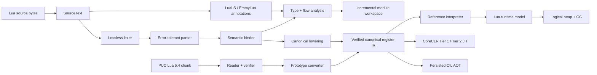

<p align="center">
  
</p>

<h1 align="center">Lunil</h1>

<p align="center">
  面向现代 .NET、以正确性为先的 Lua 5.4 编译器与托管运行时。
</p>

<p align="center">
  <a href="README.md">English</a> · <strong>简体中文</strong>
</p>

<p align="center">
  <a href="https://github.com/dlqw/Lunil/actions/workflows/ci.yml"></a>
  <a href="https://github.com/dlqw/Lunil/releases"></a>
  <a href="LICENSE"></a>
  
  
  
</p>

Lunil 是使用纯 C# 实现的 Lua 5.4.8 编译器管线与运行时。它在保留 Lua
面向字节的源码及二进制字符串语义的同时，提供不可变语法树、语义分析、
经过验证的 canonical IR、PUC Lua 二进制 chunk 互操作、托管解释器和显式逻辑垃圾回收器。

> [!IMPORTANT]
> 当前源码版本是 **`0.8.0-alpha.1`**；稳定版 `0.7.0` 及其 API/package baseline 保持
> 不可变。本 Alpha 开发更快的 PUC chunk lowering、Hosting/CLI 合格 JIT 选择、线性字符串
> 标准库构造、有界 JIT fallback、连续 unboxed 数值区域和带守卫的 table/call 路径。
> `api/0.8.0` 是已审核快照而非 Beta freeze，完整 conformance、package、六 RID 与性能门槛
> 仍然必须通过。

## 目录

- [为什么选择 Lunil](#为什么选择-lunil)
- [项目状态](#项目状态)
- [功能](#功能)
- [快速开始](#快速开始)
- [将 Lunil 用作库](#将-lunil-用作库)
- [技术架构](#技术架构)
- [仓库结构](#仓库结构)
- [兼容性与平台](#兼容性与平台)
- [软件包与发布](#软件包与发布)
- [文档索引](#文档索引)
- [参与贡献](#参与贡献)
- [安全问题](#安全问题)
- [开源许可](#开源许可)

## 为什么选择 Lunil

- **Lua 语义优先**：目标是忠实实现 Lua 5.4.8 的语法、opcode、数值行为、多返回值、
  vararg、协程、元表、待关闭变量和二进制 chunk，不用 CLR 行为静默替代 Lua 行为。
- **托管且可嵌入**：面向 .NET 10 使用 C# 实现，提供显式所有权、资源预算、handle、
  protected error 和宿主 API。
- **统一且可验证的 IR**：源码编译与导入的 PUC Lua chunk 最终汇合到同一份 canonical
  register IR，并执行结构和控制流验证。
- **面向多层执行后端**：reference interpreter、持久化 CIL AOT 与 profile-guided
  CoreCLR Tier 1/Tier 2 JIT、带守卫的精确数值 loop OSR 已共享同一套 verified execution
  contract；NativeAOT 构建集成继续复用该 ABI。
- **可测试性是架构的一部分**：内置确定性 fuzz、GC stress、畸形输入、二进制往返和
  PUC Lua 差分测试。

## 项目状态

| 领域 | 状态 | 说明 |
| --- | --- | --- |
| Lexer 与 parser | 已实现 | 完整 Lua 5.4 文法、无损 trivia、有界错误恢复 |
| Binding 与 lowering | 已实现 | 局部变量、捕获、`_ENV`、属性、label/goto、verified canonical IR |
| 二进制 chunk | 已实现 | 有界 Lua 5.4 reader/writer/verifier 与 PUC prototype 转换 |
| Reference interpreter | 已实现 | 调用、vararg、多返回值、控制流、协程、错误和 close unwind |
| Runtime 与逻辑 GC | 已实现 | 表、值、元表、配额、handle、弱表、ephemeron 和 finalizer |
| 标准库 | 已实现 | basic、coroutine、table、string、math、utf8、package、io、os 与 debug |
| JIT / AOT 后端 | `0.8` Alpha | 合格 Tier 1/Tier 2/loop OSR 与 persisted CIL 保留稳定门槛；本里程碑新增有界 terminal fallback、连续/unboxed 数值区域和带守卫的 table/call 特化 |
| Compiler 产品 API | 稳定 `0.7` | 统一的有界 lex/parse/bind/lower/verify 管线、不可变结果、阶段诊断、取消边界和 canonical source identity |
| Hosting 产品 API | 稳定 `0.7` | 可复用 compile/execute 宿主、Trusted/Restricted/Deterministic 能力 profile 和运行时预算 |
| 注解产品 API | 稳定 `0.7` | 共享有界 annotation lexer/type AST、LuaLS 默认 parser、legacy EmmyLua 兼容、未知标签保留、可配置诊断和 suppression |
| 类型与流分析 API | 稳定 `0.7` | semantic type/type-pack、annotation declaration、constraint、CFG、函数/返回推断、nil/type/assert/判别字段收窄、definite assignment、unreachable、generic、source suppression 和确定性 widening 预算 |
| Workspace 产品 API | 稳定 `0.7` | 稳定 module/source identity、可注入 resolver、静态/动态 require 分类、SCC fixed point、内容寻址缓存、最小失效、有界并行、取消与确定性合并 |
| CLI | 稳定 `0.7` | 已打包的 `lunil` 工具，提供 `run`/`check`/`build`/`dump`、稳定退出码、text/JSON 诊断、stdin、响应文件、分层配置、workspace 解析、资源预算与 trusted/sandbox/deterministic profile |
| 稳定性契约 | 活跃 Alpha | 稳定 `0.7.0` 保持冻结；`0.8.0-alpha.1` 允许已审核功能/API 工作，不能直接晋级稳定版 |

### 当前后端就绪情况

| 执行路径 | Release 行为 | `0.8.0-alpha.1` 就绪情况 |
| --- | --- | --- |
| Reference interpreter | 显式 Tier 0 与精确 fallback | 已实现，并作为语义参考实现 |
| CoreCLR Tier 1 JIT | 对重复变热且收益资格通过的函数使用 `Auto` | 六个发布 RID 均已通过资格验证 |
| 精确数值 Tier 2 JIT | Tier 1 资格通过后自动晋升 | 六个发布 RID 均已通过；managed semantic profile 默认留在 Tier 1 |
| 精确数值 loop OSR | 循环结构与运行时数值资格通过后默认启用 | 六个发布 RID 均已通过；非精确数值循环会在编译前被拒绝 |
| Persisted CIL AOT | 显式 artifact 编译、验证、collectible load 与执行 | 运行时路径和生产性能门槛在六个发布 RID 上均已通过 |
| 构建期 AOT / NativeAOT | 使用 `Lunil.Build` 时生成静态 registry；动态模块回退解释器 | 六个发布 RID 的 build/publish 集成均已验证 |

稳定 `0.7.0` 证据继续作为回归下限。`0.8.0-alpha.1` 在不改变冻结 `api/0.7.0` 契约的
前提下叠加其[更新日志](changelogs/0.8.0-alpha.1.md)所述工作。

## 功能

### 编译器与 IR

- 不可变的字节型 `SourceText`，同时提供 byte 与 UTF-16 诊断位置。
- 保留 trivia 的无损 lexer，以及完整的数值/字符串 literal 解码。
- 覆盖完整 Lua 5.4 文法、支持错误恢复的不可变语法树。
- 支持局部变量、捕获、`_ENV`、属性、label 和 goto 的 lexical binding。
- 从语法/语义模型 lowering 到经过验证的 canonical register IR。
- 公共 `LuaCompiler` 管线，提供有界阶段选项、稳定的阶段归属诊断、取消边界、
  不可变结果和逻辑 source identity。
- 公共 LuaLS/legacy EmmyLua 注解前端，提供有界 lexer/type parser、独立方言 parser、
  compatibility resolution、未知标签保留与诊断 suppression；注解不会进入 runtime IR。
- 公共 `Lunil.Analysis` 阶段，提供不可变 semantic type/type-pack、class/alias/enum declaration、
  structural table、overload、generic、constraint 与 CFG；流分析覆盖 nil/type/assert/判别字段/
  短路收窄、definite assignment、unreachable、return-pack inference、source suppression 和有界 widening。
- 公共 `Lunil.Workspace` 层，提供稳定 module/source identity、内存与 root-confined 文件 resolver、
  direct-global 静态 `require` 提取、动态边界、确定性 SCC fixed point、依赖感知 export type、
  内容寻址 cache、最小失效、全局预算、取消、有界并行调度和确定性结果合并。
- 完整 Lua 5.4 opcode 模型与二进制兼容的 32 位指令布局。
- 有界 PUC Lua 5.4 binary chunk 读取、写入、验证和转换。

### 运行时

- 16 字节 tagged value 表示和 Lua 二进制字符串。
- Heap-owned table、closure、thread、upvalue 和 native callable descriptor。
- Array 加开放寻址 hash 的 Lua table，支持 tombstone 与稳定的 `next` 遍历。
- 支持 barrier、remembered set、弱表、ephemeron、finalizer、resurrection、配额和宿主
  handle 的增量/分代三色逻辑 GC。
- 支持 numeric-string coercion、资源预算、tail call、多返回值、vararg 和开放栈窗口的
  reference interpreter。
- 非递归协程调度器与可恢复 native continuation ABI。
- 类型/对象共享元表派发、`pcall`/`xpcall` 和可恢复的 `__close` unwind。

### 标准库

- 完整托管实现 Lua 5.4 basic、coroutine、table、string、math、utf8、package、io、os
  与 debug，可通过 `LuaStandardLibrary.InstallAll` 一次安装。
- 显式 Lua pattern VM、`string.format`、二进制 `pack`/`unpack`，以及供 `string.dump`
  使用的 canonical IR 到 Lua 5.4 chunk 反向生成。
- Full/light userdata、registry、文件 userdata 生命周期、close/finalizer、debug hook、
  嵌套可恢复 callback 与 generic-for closing value。
- 可注入 filesystem、console、environment、operating-system、clock、process、locale、
  timezone 和 pipe provider，便于确定性测试与宿主沙箱。
- 支持纯 Lua `package` loader。由于 Lunil 不提供 Lua C ABI，native Lua C module 保持不支持。

### 验证与质量

- 面向执行的 binary chunk 与 canonical IR verifier。
- PUC Lua 5.4.8 二进制/运行时差分 fixture，以及覆盖字符串、pattern、pack、math、UTF-8、
  文件、加载和 debug 行为的 portable 标准库测试套件。
- 确定性的畸形 IR、table、GC 与 coroutine fuzz。
- GC stress、所有权测试和 runtime benchmark harness。
- Windows、Linux、macOS CI，以及 x64/Arm64 发布产物。

### 命令行产品

- `lunil run` 会先对源码 workspace 做预检，也可直接执行通过验证的 PUC Lua 5.4 chunk；
  主 chunk vararg 与全局 `arg` 会被正确发布，程序输出与诊断保持分离。
- `lunil check` 支持多入口跨模块类型分析；`lunil build` 可输出便携 Lua 5.4 chunk，或
  persisted CIL AOT assembly/PDB/manifest；`lunil dump` 可用 text/JSON 查看 summary、syntax、
  annotations、analysis、IR 与 chunk。
- defaults、`lunil.json`、`LUNIL_*` 环境变量、响应文件与直接 CLI 参数具有明确优先级；
  trusted、root-confined 只读 sandbox 与 deterministic profile 均支持输入、指令、栈、调用深度和
  heap 预算。
- `--execution auto|interpreter|jit`、JSON `execution` 与 `LUNIL_EXECUTION` 选择合格执行
  后端；`auto` 在动态代码可用时使用 JIT，在 NativeAOT 使用解释器，check/build/dump 不再
  初始化执行宿主。
- `Lunil.Cli` .NET tool package 与 RID bundle 经过安装/执行 smoke；NativeAOT、trimmed
  single-file 与 ReadyToRun CLI 发布会在 CI 中验证 parser、配置、JSON 诊断与 build。

## 快速开始

### 环境要求

- [.NET SDK 10.0.103](https://dotnet.microsoft.com/download/dotnet/10.0) 或兼容的
  10.0 patch 版本；
- Git；
- 可选：用于互操作 fixture 的 PUC Lua 5.4.8 工具。

### 安装并使用 CLI

从已经配置的 GitHub Packages source 安装 tag 对应的工具包，或在源码 checkout 中直接运行项目：

```bash
dotnet tool install --global Lunil.Cli --version 0.8.0-alpha.1
lunil --version

lunil run app.lua -- one two
lunil check app.lua --module-root . --warnings-as-errors
lunil build app.lua --target chunk --output app.luac
lunil build app.lua --target aot --output artifacts/aot
lunil dump app.lua --kind analysis --format json
```

使用 `-` 读取 stdin 源码，使用 `@arguments.rsp` 读取 UTF-8 响应文件，并通过 `lunil.json`
保存项目默认值。配置、profile、诊断和退出码详见 [CLI 参考](docs/cli.md)。

### 从源码构建

```bash
git clone https://github.com/dlqw/Lunil.git
cd Lunil
dotnet restore Lunil.sln
dotnet build Lunil.sln --configuration Release --no-restore
dotnet test Lunil.sln --configuration Release --no-build --no-restore
```

检查格式或运行 benchmark：

```bash
dotnet format Lunil.sln --verify-no-changes --no-restore
dotnet run --configuration Release \
  --project benchmarks/Lunil.Runtime.Benchmarks -- 1000000
```

## 将 Lunil 用作库

Tag 发布提供六 RID bundle，并将对应的 `Lunil.*` NuGet package 和 symbol package
发布到 GitHub Packages；也可以从源码 checkout 直接引用项目。

```xml
<PackageReference Include="Lunil.Hosting" Version="0.8.0-alpha.1" />
```

高层宿主通过一个可复用 state 完成编译、验证、标准库安装和执行。默认 profile 为
Restricted，默认执行后端为 `Auto`：动态代码 runtime 使用合格 JIT，否则使用 reference
interpreter。Trusted 能力、确定性 capability 与强制执行后端都必须显式选择：

```csharp
using Lunil.Hosting;
using Lunil.Runtime.Execution;

const string lua = """
    local total = 0
    for i = 1, 10 do
        total = total + i
    end
    return total
    """;

var host = new LuaHost(LuaHostOptions.Restricted);
var run = host.RunUtf8(lua, "@examples/sum.lua");

if (!run.CompilationSucceeded)
{
    foreach (var diagnostic in run.Compilation.Diagnostics)
    {
        Console.Error.WriteLine($"{diagnostic.Phase} {diagnostic.Code}: {diagnostic.Message}");
    }

    return;
}

if (run.Execution?.Signal != LuaVmSignal.Completed)
{
    throw new InvalidOperationException("Lua 执行未完成。");
}

Console.WriteLine(run.Execution.Values[0].AsInteger()); // 55
Console.WriteLine(host.SelectedExecutionBackend);       // Jit 或 Interpreter
```

将 `LuaHostOptions.ExecutionBackend` 设为 `Interpreter` 可固定 Tier 0 路径，设为 `Jit` 则
要求 runtime 支持动态代码。`LuaHost.IsDynamicCodeAvailable` 报告当前能力；JIT executor
首次惰性执行后可通过 `LuaHost.JitStatistics` 获取 telemetry。

执行经过验证的 PUC Lua 5.4 binary chunk：

```csharp
var bytecode = File.ReadAllBytes("program.luac");
var host = new LuaHost(LuaHostOptions.Restricted);
var result = host.ExecuteBinaryChunk(bytecode);
```

同一个 host 还公开可复用增量 workspace，且不会改变 runtime `package`/`require` 行为：

```csharp
using Lunil.Workspace;

using var host = new LuaHost(LuaHostOptions.Restricted);
var workspace = await host.AnalyzeWorkspaceAsync([
    LuaWorkspaceDocument.FromUtf8(
        "app",
        "local dep = require('dep')\nreturn dep.value + 1"),
    LuaWorkspaceDocument.FromUtf8("dep", "return { value = 41 }"),
]);

Console.WriteLine(workspace.GetModule("app")!.ExportedType.DisplayName); // integer
```

`LuaCompiler`、`LuaExecutor` 以及各 syntax、annotation、analysis、workspace、semantic、IR 底层包仍可独立
使用。`LuaHost` 是产品级嵌入入口；需要明确固定到 Tier 0 reference backend 时仍可直接使用
`LuaInterpreter`。

`LuaJitExecutor` 是 CoreCLR 动态后端。release 默认 policy 为 `Auto`：先由解释器执行，只有
确定性收益检查通过且重复变热的函数才会进入 Tier 1 编译队列。稳定的整数、浮点与混合数值
profile 只有在资格分析可保证生成 `ExactNumericSpecializedCil` 时才会继续自动晋升；table、closure、
call、upvalue 与 to-be-closed profile site 继续留在 Tier 1。guard 失败时精确 deopt 回 canonical
execution，并用扩宽后的 profile 重新执行资格检查。设置 `EnableTier2=false` 可完全关闭 Tier 2
profile 采集与导入；只有显式设置 `EnableTier2ManagedFallback=true` 才会允许仍属实验性的
`ManagedProfileProgram` 路径。NativeAOT 等动态代码不可用环境继续精确回退解释器且不采集 Tier 2
profile。

Loop OSR 现在独立默认开启，但只接受资格分析可保证生成 `GuardedExactNumericCil` 的 verified
natural loop，且分析会延后到 backedge 达到热度阈值。进入队列
前还必须成功观察全部数值 guard site 的精确 integer/float operand；非数值或元方法 operand 会通过
`JIT3105` 永久拒绝，不编译也不产生 guard churn。specialized emitter 只会在运行时数值资格通过后
惰性准备，因此负负载与短循环不承担一次性初始化成本。load/move、控制流、numeric-for、guarded
close 和精确数值操作会在生成的循环方法中执行，同时保留 canonical PC、预算、hook/debug、GC 与
deopt 守卫。只有显式设置 `EnableLoopOsrManagedFallback=true` 才恢复实验性的 managed canonical
loop 与 guard widening 路径。设置 `EnableLoopOsr=false` 可完整关闭分析、资格采样、emitter 准备与
编译；动态代码不可用时无论配置默认值如何都保持同样的完整回退。

在 CoreCLR 上，persisted CIL artifact 可先完成验证，再加载到 collectible context，并通过同一个
scheduler 执行；coroutine、hook、close 与异常语义无需复制实现：

```csharp
var artifact = LuaAotCompiler.Compile(lowering.Module).Artifact
    ?? throw new InvalidOperationException("Persisted CIL 编译失败。");
var loading = LuaAotArtifactLoader.Load(
    artifact,
    new LuaAotLoadOptions { ExpectedModuleContentId = artifact.Manifest.ModuleContentId });
if (!loading.Succeeded)
{
    throw new InvalidOperationException(string.Join("; ", loading.Diagnostics));
}

using var loaded = loading.Module!;
var executor = new LuaPersistedAotExecutor(loaded);
var result = executor.Execute(state, state.CreateMainClosure(lowering.Module));
```

`loading.Metrics` 分别归因验证、assembly load、delegate binding、总耗时与分配字节；
`executor.Statistics` 区分 persisted method 调用、artifact lookup fallback、预期 debug-mode deopt
与非预期 compiled deopt。`loaded` 生命周期由调用方负责；释放后 collectible context 会卸载，后续
执行从当前 canonical PC 精确回退。

处理不可信源码或 bytecode 时，应根据宿主需求配置有界 parser/chunk option、解释器
instruction/stack budget 和 heap quota。

### 构建期 AOT 与 NativeAOT

引用 `Lunil.Build`，再用 `LunilCompile` 声明 Lua source 或 PUC Lua 5.4 chunk：

```xml
<ItemGroup>
  <PackageReference Include="Lunil.Build" Version="0.8.0-alpha.1" />
  <LunilCompile Include="Modules/math.lua"
                ModuleName="app.math"
                InputKind="Source"
                Optimization="Release"
                DebugSymbols="false"
                Sandbox="Restricted" />
</ItemGroup>
```

该 package 先通过同一个 workspace graph 解析全部 source item 并报告跨模块分析诊断，再在
`CoreCompile` 前验证并编译所有模块，将确定性 artifact 写入 `obj/lunil/`，并生成不依赖 runtime
reflection 的直接 method registry。宿主可取得内嵌 canonical module，再执行其静态入口：

```csharp
if (!LuaStaticAotRegistry.TryGetModule("app.math", out var module) || module is null)
{
    throw new InvalidOperationException("未注册构建期模块。");
}

var state = new LuaState();
var result = new LuaStaticAotExecutor().Execute(state, module.CreateMainClosure(state));
```

NativeAOT publish 设置 `PublishAot=true`。动态模块仍回退解释器；动态代码不可用时 JIT 与
动态 PE load 会被禁用。metadata、增量构建、诊断码和 publish 命令见
[NativeAOT 与 MSBuild 指南](docs/nativeaot-build-integration.md)。

## 技术架构



编译器边界以 byte 为基础，发布不可变 syntax、annotation、semantic、type 与控制流模型，并将
运行时行为 lowering 到与后端无关的 IR；静态分析元数据不会进入该 IR。运行时显式建模 Lua
object、所有权、stack、continuation 与逻辑 GC，不依赖 CLR object 生命周期隐式表达 Lua 语义。
这为解释器和后续执行后端提供了共同的语义契约。

## 仓库结构

```text
Lunil/
├── src/
│   ├── Lunil.Core/              # source text、diagnostic、Lua numeric
│   ├── Lunil.Syntax/            # lexer、token、parser、immutable syntax
│   ├── Lunil.EmmyLua/           # LuaLS 与 legacy EmmyLua 注解前端
│   ├── Lunil.Analysis/          # semantic type、CFG、constraint 与流分析
│   ├── Lunil.Workspace/         # 模块图、resolver 与增量分析 cache
│   ├── Lunil.Semantics/         # binding 与 canonical lowering
│   ├── Lunil.Compiler/          # 公共有界编译管线与不可变结果
│   ├── Lunil.IR/                # canonical IR 与 Lua 5.4 binary chunk
│   ├── Lunil.Runtime/           # value、table、GC、interpreter、coroutine
│   ├── Lunil.Hosting/           # 可复用宿主、能力 profile 与执行边界
│   ├── Lunil.CodeGen.Cil/       # typed CIL plan、persisted AOT 与分级 CoreCLR JIT
│   ├── Lunil.Build/             # MSBuild task、build asset 与 NativeAOT registry 生成
│   ├── Lunil.Cli/               # 已打包的 run/check/build/dump 命令行产品
│   └── Lunil.StandardLibrary/   # 标准库注册和模块
├── tests/                       # unit、差分、fuzz 与 GC stress 测试
├── benchmarks/                  # runtime benchmark harness
├── docs/                        # 架构、ABI、分支与版本文档
├── scripts/                     # release bundle 与 NuGet 打包脚本
├── changelogs/                  # 按版本组织的发布日志
└── .github/workflows/           # CI 与 tag 驱动的发布自动化
```

## 兼容性与平台

- **语言目标**：Lua 5.4.8。
- **运行时目标**：.NET 10。
- **CI 主机**：Windows、Ubuntu Linux、macOS。
- **发布 RID**：`win-x64`、`win-arm64`、`linux-x64`、`linux-arm64`、`osx-x64`、
  `osx-arm64`。
- **Binary chunk**：严格有界的 Lua 5.4 格式和显式 target 描述；不兼容的数值表示会被拒绝，
  不会静默截断。

兼容性契约和当前里程碑的非目标请阅读[编译器设计](docs/compiler-design.md)。

## 软件包与发布

Lunil 遵循 [SemVer 2.0](https://semver.org/lang/zh-CN/)；`X.Y.Z` 与预发布后缀表达的是
两个不同维度：

| 版本变化 | 使用场景 |
| --- | --- |
| `X` major | `1.0.0` 之后的新稳定兼容性世代；当稳定版使用者必须进行有意的破坏性迁移时递增 |
| `Y` minor | `1.0.0` 前的下一个开发里程碑，或 `1.0.0` 后向后兼容的功能版本 |
| `Z` patch | 已发布稳定 `X.Y.0` 系列上的向后兼容修复与改进 |
| `alpha.N` | 正在进行功能/API 开发；允许功能未完成与破坏性更新 |
| `beta.N` | 功能和公共 API 范围已冻结；只进行兼容性、诊断、文档与性能加固 |
| `rc.N` | 稳定版候选；只接受阻断发布的问题修复 |
| 无后缀 | 稳定版，只能由审核通过的 RC 晋级得到 |

活跃 `0.8.0` 的晋级顺序是：

```text
0.8.0-alpha.N -> 0.8.0-beta.N -> 0.8.0-rc.N -> 0.8.0
```

当前源码版本是 **`0.8.0-alpha.1`**。稳定版 `0.7.0`、其 tag 与 `api/0.7.0` 保持
不可变；该稳定线的向后兼容修复使用 `0.7.1`。每发布一个 Alpha 构建都递增序号；只有完整
`0.8` 功能与公共 API 范围审核通过后才从 `beta.1` 开始晋级。当前已审核的
`api/0.8.0` 快照不是 Beta freeze。

不可变的 `v<SemVer>` tag 会触发版本一致性验证、六 RID bundle、带 symbol 的 NuGet
package、GitHub Packages 发布和 GitHub Release。带 suffix 的版本会自动标记为 prerelease。
兼容性和晋级规则见[版本策略](docs/versioning.md)。

## 文档索引

| 文档 | 内容 |
| --- | --- |
| [编译器设计](docs/compiler-design.md) | 架构、兼容性契约、IR 和后端设计 |
| [0.7.0 路线图](docs/roadmap-0.7.0.md) | Compiler/Hosting 基础、注解、分析、workspace、CLI 与晋级门槛 |
| [版本化 API/package 兼容性](docs/api-compatibility.md) | 冻结 `0.7` 数据、已审核 `0.8` 快照、NuGet 资产、验证规则与更新命令 |
| [CLI 参考](docs/cli.md) | 命令、配置优先级、profile、诊断、产物与退出码 |
| [执行后端 ABI](docs/adr/0001-execution-backend-abi-v1.md) | 已冻结的 scheduler、PC、预算、safe-point 与 codegen 契约 |
| [Loop OSR 性能生产化](docs/adr/0006-loop-osr-performance-productionization.md) | 精确数值 OSR 代码形态、资格、守卫、fallback 与性能门槛 |
| [Loop OSR rollout 证据闭环](docs/adr/0008-loop-osr-qualified-preparation-and-evidence.md) | 资格通过后的惰性 emitter 准备与平衡高样本 rollout 证据 |
| [Loop OSR 自动默认 rollout](docs/adr/0009-loop-osr-auto-default-rollout.md) | 六 RID 授权、release 默认值与显式 opt-out 契约 |
| [Persisted CIL AOT 性能生产化](docs/adr/0010-persisted-cil-aot-performance-productionization.md) | Collectible runtime 执行、加载归因、fallback 与六 RID 性能门槛 |
| [后端性能基线](docs/backend-performance-baseline.md) | JIT/AOT 工作使用的解释器基线与测量方法 |
| [跨运行时性能工作流](docs/cross-runtime-performance.md) | 原生 Lua 基线、LuaJIT/MoonSharp/Lunil 矩阵、可复现工具链与六 RID 汇报 |
| [后端缓存契约](docs/backend-cache-contract.md) | 缓存键、磁盘布局、profile 格式、配额和损坏处理 |
| [NativeAOT 与 MSBuild](docs/nativeaot-build-integration.md) | `Lunil.Build`、静态 registry、诊断码和 publish mode |
| [运行时 continuation ABI](docs/runtime-continuation-abi.md) | `0.3.0` 冻结的 continuation/yield 边界 |
| [PUC prototype 导入](docs/puc-prototype-import.md) | PUC Lua prototype 到 canonical IR 的转换 |
| [版本策略](docs/versioning.md) | SemVer、alpha/beta/RC 晋级与发布流程 |
| [分支管理](docs/branching.md) | 受保护的 `main`、分支命名与合并策略 |
| [更新日志](changelogs/) | 按版本组织的发布说明 |

## 参与贡献

欢迎提交 issue 和范围明确的 pull request。请在 `feature/*`、`fix/*` 或 `docs/*` 分支上
开发，根据影响补充测试与 changelog，并在提交前运行完整 build、test 和 format 命令。
`main` 受保护，所有必需检查通过后使用 squash merge。

参与前请阅读[分支管理](docs/branching.md)。

## 安全问题

疑似安全漏洞请不要提交公开 issue。请通过
[GitHub 私密漏洞报告](https://github.com/dlqw/Lunil/security/advisories/new)提交最小复现、
受影响版本和影响评估。

## 开源许可

Lunil 使用 [MIT License](LICENSE) 开源。

Lua 是 Lua.org、PUC-Rio 的商标。Lunil 是独立实现，与 Lua.org 或 PUC-Rio 无隶属或背书关系。
