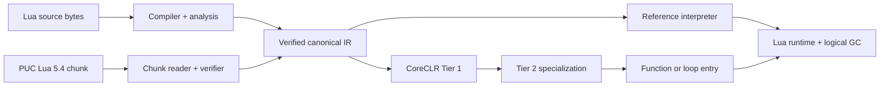

<p align="center">
  
</p>

<h1 align="center">Lunil</h1>

<p align="center">
  面向现代 .NET、正确性优先的版本化 Lua 编译器与托管运行时，并提供受能力控制的 CLR 互操作。
</p>

<p align="center">
  <a href="README.md">English</a> · <strong>简体中文</strong>
</p>

<p align="center">
  <a href="https://github.com/dlqw/Lunil/actions/workflows/ci.yml"></a>
  <a href="https://github.com/dlqw/Lunil/releases"></a>
  <a href="LICENSE"></a>
  
  
</p>

Lunil 是使用纯 C# 实现的版本化 Lua 编译器、分析工具链与 .NET 10 运行时。Lua 5.4.8 仍是默认版本，
稳定版 `0.11.0` 另外提供显式 Lua 5.1–5.5 契约。源码和版本化 PUC Lua 二进制 chunk
会汇入同一个经过验证的 canonical IR，再通过参考解释器或基于 profile 的 CoreCLR
JIT 执行；.NET NativeAOT 与 trimming 应用仍可使用相同编译器和解释器。

> [!NOTE]
> 稳定版 `0.11.0` 是当前支持版本。它暴露 Lua 5.1–5.5 的显式版本身份和独立
> PUC chunk adapter，同时保持 Lua 5.4.8 为默认版本。
> `0.11.0` 源码线增加 opt-in、精确 allowlist 的 CLR 类型发现与对象构造 bridge；
> 嵌入 Host 未配置时该 bridge 保持禁用。
> 当前源码树为 `0.12.0-alpha.16` 热更新预览，新增协调式 target 流量隔离、有界 prepare
> backpressure，以及原子 CLR callback generation fencing；它不是稳定 package 版本线。

## 性能

正式 `0.10.0` 数据集使用完全相同的 Lua 源码，在八个工作负载、六轮平衡采样和 `win-x64`
发布 RID 上测试。PUC Lua 5.4.8 归一化为 `1.000x`，数值越高越快。每行标注语义分组，
比较仅在兼容的语言契约之间进行。

| 引擎 | 版本 | 语义分组 | 相对 PUC Lua 5.4.8 几何均值 |
| --- | --- | --- | ---: |
| LuaJIT | 2.1（commit `3c4f9fe`） | `lua51-dialect` | 9.376x |
| **Lunil Auto JIT** | **0.10.0** | **lua54** | **1.475x** |
| Luau | 0.623 | `lua51-dialect` | 1.056x |
| PUC Lua | 5.4.8 | `lua54` | 1.000x |
| Wasmoon | 1.16.0 | `lua54` | 0.470x |
| NeoLua | 1.3.19 | `managed-dotnet` | 0.352x |
| UniLua | `194eb311` | `lua52-managed` | 0.308x |
| GopherLua | 1.1.1 | `lua51-dialect` | 0.214x |


| Auto JIT 工作负载 | 相对 PUC Lua 5.4.8 |
| --- | ---: |
| 算术循环 | 1.321x |
| 迭代 Fibonacci | 3.203x |
| Mandelbrot | 3.339x |
| 控制流 | 1.661x |
| 函数调用 | 2.839x |
| 表访问 | 0.377x |
| 素数筛 | 0.450x |
| 字符串构建 | 1.980x |


默认 Auto JIT 在 `string_build` 工作负载上达到 PUC Lua 5.4.8 的 `1.980x`。经过审核的发行数据、
测试环境、固定参考版本与命令均保存在[机器可读数据集](benchmarks/results/0.10.0-performance.json)中。

## 主要能力

- **Lua 5.4 语义**：完整语法、二进制字符串、整数/浮点行为、多返回值、vararg、coroutine、
  metatable、to-be-closed 变量、binary chunk 与标准库。
- **经过验证的编译管线**：byte-oriented source text、无损语法树、绑定、类型与流分析、workspace
  分析、canonical lowering 与独立 IR 验证。
- **强类型分析嵌入**：0.12 预览版提供 call、member、function、parameter、block facade 与可扩展
  visitor，同时保留无损语法树作为高级场景的 escape hatch。
- **稳定符号身份**：0.12 预览版提供跨 compilation 与 workspace snapshot 的可序列化 symbol/function
  key，不依赖源码 offset 或瞬时 ID。
- **代码智能索引**：直接提供 typed call site、未解析调用保留、reference 查询以及
  compilation/workspace call graph，无需宿主重新解释 generic AST。
- **可运行分析嵌入**：由 CI 实际执行的 sample 覆盖 compiler、semantics、annotation、CFG、
  call/reference index、循环 workspace、稳定身份与 cache 失效。
- **托管运行时**：显式 Lua value、table、closure、thread、upvalue、资源预算、protected error、
  host handle、弱表、ephemeron、finalizer 与逻辑 GC。
- **自适应执行**：动态代码可用时，默认 Auto JIT 选择经过验证的编译路径；否则使用参考解释器。
- **可嵌入与可沙箱化**：可复用 Hosting API，提供 Restricted、Trusted 与 Deterministic 能力配置。
- **受能力控制的 CLR bridge**：0.11 可以发现、构造和调用精确 allowlist 中的 CLR 类型，
  不会加载 assembly，也不会开放无限制 reflection。
- **生产热更新预览**：支持 key 轮换与撤销的签名 Patch Bundle、由 signer 授权的回滚、capability
  准入与签名 target selector、游戏循环原子发布、状态与资源迁移、多 State ring 灰度、具备排他
  ownership 与 compaction 生命周期的持久恢复 journal，以及 .NET telemetry。
- **跨平台**：Windows、Linux、macOS 的 x64/Arm64 bundle；动态代码不可用时 NativeAOT 与 trimming
  会确定性回退解释器。

## 0.11.0 CLR 互操作

CLR 互操作是 opt-in 且 fail-closed 的。Host 必须授予所需 capability，并提供精确、大小写敏感的
assembly、type、member、delegate 和 event allowlist；bridge 只搜索已经加载的 assembly，不会暴露
无限制 reflection。

```csharp
var options = LuaHostOptions.Restricted with
{
    Clr = new LuaClrOptions
    {
        Capabilities = LuaClrCapabilities.TypeDiscovery |
            LuaClrCapabilities.Construction | LuaClrCapabilities.MemberAccess,
        AllowedAssemblyNames = ["Example.Contracts"],
        AllowedTypeNames = ["Example.Contracts.Point"],
        AllowedMemberNames = ["Translate"],
        InstallGlobalModule = true,
    },
};
using var host = new LuaHost(options);
var result = host.RunUtf8(
    "local p = clr.new('Example.Contracts.Point', 1, 2); return p:Translate(3)");
```

安装后的 `clr` 模块提供确定性的类型发现与构造、显式 member 访问与调用、可释放的 event
subscription、`Task`/`ValueTask` 等待、取消和幂等释放。Allowlist 内的 userdata 还支持 property、
field、indexer、operator 与 bound method。Delegate 转换和 event callback 需要独立 allowlist，并且
遵守 Lua state ownership。转换、overload、NativeAOT、trimming 与部署细节见 [CLR 互操作文档](docs/clr-interop.zh-CN.md)。

由于 Lunil 不公开 Lua C ABI，因此不支持原生 Lua C module。

## 0.12 预览版强类型语法分析

强类型 facade 让常见源码分析不再依赖 grammar shape 和 child 顺序。下面的 walker 可以发现
括号调用和字符串简写调用中的 UTF-8 常量 `require` 请求。Facade 包含 recovery node 或 missing
token 时，`IsComplete` 为 false；高级处理仍可通过 `Node` 访问底层无损语法。

```csharp
using Lunil.Core.Text;
using Lunil.Syntax.Parsing;

var syntax = LuaParser.Parse(SourceText.FromUtf8("local m = require 'game.player'"));
var walker = new RequireWalker(syntax.Source);
walker.Visit(syntax.Root);

sealed class RequireWalker(SourceText source) : LuaSyntaxWalker
{
    public override void VisitCallExpression(LuaCallExpressionSyntax call)
    {
        if (!call.IsMethodCall &&
            call.Callee?.TryGetIdentifierToken(out var identifier) == true &&
            identifier.GetText(source) == "require" &&
            call.Arguments.FirstOrDefault()?.TryGetConstantString(out var module) == true)
        {
            Console.WriteLine(module);
        }

        base.VisitCallExpression(call);
    }
}
```


## 0.12 预览版稳定 symbol key

持久化 symbol 或 function key 时应使用逻辑 module 名称，而不是宿主绝对路径。序列化后的值可在
后续 snapshot 中重建。插入空白、注释或不相关声明不会改变命名 symbol 的 key；重命名、模块变化和
lexical owner 变化可以产生新 key。Annotation declaration 可通过
`LuaCompilationResult.GetAnnotationKey`
使用相同的 canonical 格式。

```csharp
using System.Linq;
using Lunil.Compiler;
using Lunil.Semantics.Binding;

var moduleName = "game/player";
var compilation = new LuaCompiler().CompileUtf8(
    "local health = 100",
    sourceName: "game/player.lua");
var semanticModel = compilation.SemanticModel;
var symbol = semanticModel.Symbols.Single(symbol => symbol.Name == "health");
var key = semanticModel.GetSymbolKey(symbol, moduleName);
var persisted = new LuaSymbolKey(key.Value);
var current = semanticModel.ResolveSymbolKey(persisted, moduleName);
```

## 0.12 预览版 call graph 与 reference 查询

`LuaAnalysisResult.CallGraph` 会保留 resolved、dynamic、unresolved 和 unreachable call site。
每条 edge 都包含 containing function、callee/receiver type、direct symbol/name、可选 module request，
以及存在时的静态 function target。Reference 查询保留 local/upvalue 身份，并为隐式 `_ENV` global
提供按名称查询的独立入口。

```csharp
using System.Linq;
using Lunil.Compiler;

var compilation = new LuaCompiler().CompileUtf8("""
    local function tick() return 1 end
    return tick()
    """);
var tick = compilation.SemanticModel.Symbols.Single(symbol => symbol.Name == "tick");
var references = compilation.SemanticModel.FindReferences(tick);
var call = compilation.Analysis.CallGraph.Edges.Single();
```

对完成的 `LuaWorkspaceResult`，`FindReferences(LuaSymbolKey)`、`FindGlobalReferences(string)` 与
`GetCallGraph()` 会补充 module/source identity、稳定 function key 和保守的 module export target；
发生重新赋值的 module alias 不会被误报为静态 module target。

[静态分析嵌入指南](docs/static-analysis-embedding.zh-CN.md)及其
[可执行 sample](samples/Lunil.StaticAnalysis.Embedding/EmbeddingScenario.cs)覆盖 UTF-8 byte span 与
UTF-16 编辑器位置、诊断 phase、稳定 snapshot identity、CFG、workspace cycle、cache 失效、
生命周期、并发和生产预算。

## 快速开始

### 环境要求

- [.NET SDK 10.0.103](https://dotnet.microsoft.com/download/dotnet/10.0) 或兼容的 .NET 10 patch；
- 从源码构建时需要 Git。

### CLI

从已配置的 GitHub Packages source 安装稳定版 `0.11.0`，或直接在源码 checkout 中运行：

```bash
dotnet tool install --global Lunil.Cli --version 0.11.0
lunil --version

lunil run app.lua -- one two
lunil check app.lua --module-root . --warnings-as-errors
lunil build app.lua --target chunk --output app.luac
lunil dump app.lua --kind analysis --format json
```

使用 `-` 读取 stdin 源码，使用 `@arguments.rsp` 读取 UTF-8 响应文件，并通过 `lunil.json` 保存项目
默认值。命令、profile、诊断与退出码见 [CLI 参考](docs/cli.md)。

### 从源码构建

```bash
git clone https://github.com/dlqw/Lunil.git
cd Lunil
dotnet restore Lunil.sln
dotnet build Lunil.sln --configuration Release --no-restore
dotnet test Lunil.sln --configuration Release --no-build --no-restore
```

## 嵌入 Lunil

引用稳定版 Hosting package：

```xml
<PackageReference Include="Lunil.Hosting" Version="0.11.0" />
```

通过可复用的 Restricted host 编译并执行：

```csharp
using Lunil.Hosting;
using Lunil.Runtime.Execution;

const string lua = """
    local total = 0
    for i = 1, 10 do
        total = total + i
    end
    return total
    """;

using var host = new LuaHost(LuaHostOptions.Restricted);
var run = host.RunUtf8(lua, "@examples/sum.lua");

if (!run.CompilationSucceeded)
{
    foreach (var diagnostic in run.Compilation.Diagnostics)
    {
        Console.Error.WriteLine($"{diagnostic.Phase} {diagnostic.Code}: {diagnostic.Message}");
    }
    return;
}

if (run.Execution?.Signal != LuaVmSignal.Completed)
{
    throw new InvalidOperationException("Lua 执行未完成。");
}

Console.WriteLine(run.Execution.Values[0].AsInteger()); // 55
```

可通过 `LuaHostOptions.ExecutionBackend` 强制解释器或动态 JIT。默认 `Auto` 在动态代码可用时使用
合格 JIT，否则使用参考解释器。Compiler、Syntax、Analysis、Workspace、IR、Runtime 与标准库 package
也可独立使用。

## 架构



所有执行路径共享 canonical PC、精确指令计数、资源预算、safe point、debug 行为、失效与 fallback
语义。

## 兼容性

- 语言目标：默认 Lua 5.4.8；稳定版 `0.11.0` 提供显式 Lua 5.1–5.5 目标。
- 运行时目标：.NET 10。
- 发布 RID：`win-x64`、`win-arm64`、`linux-x64`、`linux-arm64`、`osx-x64`、`osx-arm64`。
- Binary chunk：有界 Lua 5.4 格式与显式目标校验；不兼容的数值布局会被拒绝，而不是截断。
- 稳定线：`0.11.x`（当前版本 `0.11.0`）；`0.10.x` 仍兼容既有 Host。
- 预览源码线：`0.12.0-alpha.5`；其 reviewed API snapshot 在稳定版 `0.12.0` freeze 前仍可扩展。

兼容性变更和部署说明见 [`0.11.0` 迁移指南](docs/migration-0.11.0.zh-CN.md)。.NET NativeAOT 仍是受支持的宿主发布方式，详见
[.NET NativeAOT 与 trimming（简体中文）](docs/nativeaot-build-integration.zh-CN.md)。

## 文档

| 文档 | 内容 |
| --- | --- |
| [CLR 互操作](docs/clr-interop.zh-CN.md) | Allowlist 配置、构造、转换、ownership 与发布约束 |
| [签名 Patch Bundle](docs/hot-update.zh-CN.md) | Patch 信任、target 隔离与 quiescence、游戏循环安全点、多 State ring 灰度、持久恢复 journal 与 CLI 工作流 |
| [CLI 参考](docs/cli.md) | 命令、配置、profile、诊断与退出码 |
| [.NET NativeAOT 与 trimming](docs/nativeaot-build-integration.zh-CN.md) | 宿主集成、trimming 标注与发布验证 |
| [PUC Lua prototype 导入](docs/puc-prototype-import.zh-CN.md) | 导入经过校验的 PUC Lua 5.4 binary prototype |
| [更新日志](changelogs/) | 按版本组织的社区发布说明 |

## 参与贡献

欢迎提交 issue 和范围明确的 pull request。请在 `feature/*`、`perf/*`、`fix/*` 或 `docs/*` 分支上
开发，按影响
补充测试，并在请求审核前运行 build、test、format 与相关文档检查。

## 安全问题

疑似安全漏洞请通过 [GitHub 私密漏洞报告](https://github.com/dlqw/Lunil/security/advisories/new)
提交，不要创建公开 issue。

## 许可证

Lunil 使用 [MIT License](LICENSE)。
