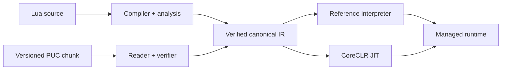
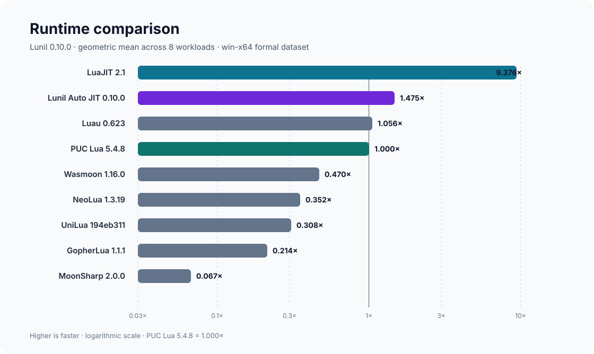

<p align="center">
  
</p>

<h1 align="center">Lunil</h1>

<p align="center">
  面向 .NET、正确性优先的版本化 Lua 编译器、分析工具链与托管运行时。
</p>

<p align="center">
  <a href="README.md">English</a> · <strong>简体中文</strong>
</p>

<p align="center">
  <a href="https://github.com/dlqw/Lunil/actions/workflows/ci.yml"></a>
  <a href="https://github.com/dlqw/Lunil/releases/tag/v0.12.1"></a>
  <a href="LICENSE"></a>
  
  
</p>

Lunil 将 Lua 源码与版本化 PUC Lua binary chunk 编译到同一个经过验证的 canonical IR。该 IR
可以通过参考解释器或基于 profile 的 CoreCLR JIT 执行。Lua 5.4.8 是默认语言契约，同时也提供显式
Lua 5.1、5.2、5.3 和 5.5 契约。

> [!NOTE]
> `0.12.1` 是当前稳定版，目标运行时为 .NET 10。动态代码不可用时，NativeAOT 与 trimming 应用
> 使用解释器。

## Lunil 提供什么

- **版本化 Lua 行为**：源码解析、标准库、runtime 语义和 binary chunk 遵循所选 Lua 5.1–5.5
  契约。
- **经过验证的编译**：无损 UTF-8 syntax、binding、type/flow analysis、canonical lowering 与
  独立 IR verification。
- **代码智能**：强类型 syntax facade、annotation、稳定 symbol/function key、reference、CFG、
  call graph 与可复用 workspace。
- **托管执行**：显式 Lua value、table、closure、coroutine、资源预算、逻辑 GC、解释器与自适应 JIT。
- **受控嵌入**：Trusted、Restricted、Deterministic host profile，以及受 capability 控制、使用精确
  allowlist 的 CLR bridge。
- **生产更新**：签名 Patch Bundle、游戏循环原子发布、状态/资源迁移、多 State 灰度和持久恢复
  journal。
- **可移植部署**：Windows、Linux、macOS 的 x64/Arm64 release bundle，并支持 .NET NativeAOT
  与 trimming。

Lunil 不公开 Lua C ABI，因此不支持原生 Lua C module。

## 快速开始

### 运行 CLI

安装 [.NET SDK 10.0.103](https://dotnet.microsoft.com/download/dotnet/10.0) 或兼容的 .NET 10
patch release。然后从 [Lunil 0.12.1 release](https://github.com/dlqw/Lunil/releases/tag/v0.12.1)
下载对应 RID 的 archive，解压并运行：

```bash
./lunil --version
./lunil run app.lua -- one two
./lunil check app.lua --module-root . --warnings-as-errors
./lunil build app.lua --target chunk --output app.luac
./lunil dump app.lua --kind analysis --format json
```

Windows 使用 `lunil.exe`。如果已经把 GitHub Packages 配置为 NuGet source，也可以将 CLI 安装为
.NET tool：

```bash
dotnet tool install --global Lunil.Cli --version 0.12.1
lunil --version
```

使用 `-` 读取 source stdin，使用 `@arguments.rsp` 读取 UTF-8 response file，并通过 `lunil.json`
保存项目默认值。全部命令和选项见[命令行参考](docs/cli.zh-CN.pub.md)。

### 嵌入 runtime

从已配置的 package source 或下载的 release package 引用 `Lunil.Hosting` `0.12.1`：

```xml
<PackageReference Include="Lunil.Hosting" Version="0.12.1" />
```

通过可复用的 Restricted host 编译并执行：

```csharp
using Lunil.Hosting;
using Lunil.Runtime.Execution;

using var host = new LuaHost(LuaHostOptions.Restricted);
var run = host.RunUtf8("return 40 + 2", "@examples/answer.lua");

if (!run.CompilationSucceeded)
{
    foreach (var diagnostic in run.Compilation.Diagnostics)
    {
        Console.Error.WriteLine($"{diagnostic.Code}: {diagnostic.Message}");
    }
    return;
}

if (run.Execution?.Signal != LuaVmSignal.Completed)
{
    throw new InvalidOperationException("Lua 执行未完成。");
}

Console.WriteLine(run.Execution.Values[0].AsInteger()); // 42
```

`LuaHostOptions.ExecutionBackend` 可以选择 `Auto`、`Interpreter` 或 `Jit`。`Auto` 在动态代码可用时
使用经过验证的 JIT，否则使用参考解释器。

### 从源码构建

```bash
git clone https://github.com/dlqw/Lunil.git
cd Lunil
dotnet restore Lunil.sln
dotnet build Lunil.sln --configuration Release --no-restore
dotnet test Lunil.sln --configuration Release --no-build --no-restore
```

## 执行模型


```mermaid
flowchart LR
    Source[Lua source] --> Compiler[Compiler + analysis]
    Chunk[Versioned PUC chunk] --> Reader[Reader + verifier]
    Compiler --> IR[Verified canonical IR]
    Reader --> IR
    IR --> Interpreter[Reference interpreter]
    IR --> JIT[CoreCLR JIT]
    Interpreter --> Runtime[Managed runtime]
    JIT --> Runtime
```

解释器和 JIT 执行共享 canonical PC、instruction accounting、资源预算、safe point、失效和 fallback
语义。

## 兼容性

| 接口 | 支持契约 |
| --- | --- |
| 稳定版 | `0.12.1` |
| 语言 | 默认 Lua 5.4.8；显式 Lua 5.1–5.5 target |
| Runtime | .NET 10 |
| Release RID | `win-x64`、`win-arm64`、`linux-x64`、`linux-arm64`、`osx-x64`、`osx-arm64` |
| Binary chunk | 按版本区分、带资源上限、经过结构与 target 验证的 PUC 格式 |
| 动态代码不可用 | Compiler、analysis、标准库与解释器仍可用 |

## 性能快照

已发布的 `0.10.0` `win-x64` 数据集对八个工作负载使用完全相同的 Lua 源码，并进行六轮平衡
采样。PUC Lua 5.4.8 归一化为 `1.000x`，数值越高越快。

| 对比 | 吞吐量几何均值比率 |
| --- | ---: |
| **Lunil Auto JIT 0.10.0 / MoonSharp 2.0.0** | **21.796x** |
| Lunil Auto JIT 0.10.0 / PUC Lua 5.4.8 | 1.475x |

结果、固定 engine 版本、环境详情与命令见
[机器可读数据集](benchmarks/results/0.10.0-performance.json)。



## 文档

| 文档 | 类型 | 内容 |
| --- | --- | --- |
| [命令行参考](docs/cli.zh-CN.pub.md) | Reference | 命令、配置、profile、诊断与退出码 |
| [配置 CLR 互操作](docs/clr-interop.zh-CN.pub.md) | How-to | Allowlist 配置、callback、timer、stable resource 与部署 |
| [CLR 互操作参考](docs/clr-interop-reference.zh-CN.pub.md) | Reference | Lua 函数、转换、policy、gauge、上限与 ownership 契约 |
| [CLR bridge 生命周期](docs/clr-interop-lifecycle.zh-CN.pub.md) | Explanation | Capability 边界、state ownership、异步准入与 generation fencing |
| [部署签名 Patch Bundle](docs/hot-update.zh-CN.pub.md) | How-to | Bundle 创建、preparation、publication、migration、rollout 与 recovery |
| [签名 Patch Bundle 参考](docs/hot-update-reference.zh-CN.pub.md) | Reference | Manifest、信任、replay、migration、上限、status、store 与 telemetry |
| [热更新发布](docs/hot-update-lifecycle.zh-CN.pub.md) | Explanation | 原子 publication、identity migration、generation、ring 与 durability |
| [嵌入静态分析](docs/static-analysis-embedding.zh-CN.pub.md) | How-to | Syntax、semantic data、稳定 key、CFG、call graph 与 workspace |
| [使用 NativeAOT 与 trimming 发布](docs/nativeaot-build-integration.zh-CN.pub.md) | How-to | 解释器 fallback、SDK 发布与 metadata 保留 |
| [导入 PUC Lua 5.4 prototype](docs/puc-prototype-import.zh-CN.pub.md) | How-to | 将经过验证的 binary chunk 转换到 canonical IR |
| [迁移指南](docs/migration-0.11.0.zh-CN.pub.md) | How-to | [0.8.0](docs/migration-0.8.0.zh-CN.pub.md)、[0.10.0](docs/migration-0.10.0.zh-CN.pub.md) 与 0.11.0 的历史变化 |

每篇指南都在页面顶部链接事实等价的英文与简体中文版本。

## 安全问题

疑似安全漏洞请通过 [GitHub 私密漏洞报告](https://github.com/dlqw/Lunil/security/advisories/new)
提交，不要创建公开 issue。
