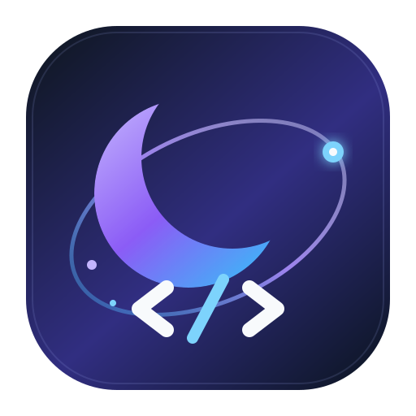

<p align="center">
  
</p>

<h1 align="center">Lunil</h1>

<p align="center">
  面向 .NET、Unity 与 Godot 的版本化 Lua 5.1–5.5 编译、分析与托管执行环境。
</p>

<p align="center">
  <a href="README.md">English</a> · <strong>简体中文</strong>
</p>

<p align="center">
  <a href="https://github.com/dlqw/Lunil/actions/workflows/ci.yml"></a>
  <a href="https://github.com/dlqw/Lunil/releases"></a>
  
  
</p>

Lunil 是纯 C# Lua 工具链。默认语言契约为 Lua 5.4，兼容性基线为 PUC Lua 5.4.8，也可显式
选择 Lua 5.1、5.2、5.3 或 5.5。源码与版本化二进制 chunk 会降低为同一套经过验证的
canonical IR，再由可移植解释器或 .NET 10 profile-guided JIT 执行。

## 主要能力

| 领域 | Lunil 提供的能力 |
| --- | --- |
| 语言与编译器 | 按版本区分的 Lua 5.1–5.5 语法和 chunk 契约、无损 UTF-8 语法树、annotation、语义绑定、canonical lowering 与独立 IR 验证。 |
| 托管运行时 | Lua value、table、closure、coroutine、metatable、protected call、逻辑 GC、资源预算、参考解释器与自适应 .NET 10 JIT。 |
| 静态分析 | Symbol、type、CFG、稳定 key、member/reference index、call graph、metatable/object model fact、closure upvalue 与 nil path 分析。 |
| Workspace 分析 | 模块发现、循环、export、跨模块 call/reference、外部宿主 contract、增量失效、compact snapshot，以及面向大型 repository 的有界 cache。 |
| Hosting 与互操作 | Restricted、Trusted、Deterministic host，精确 allowlist CLR 访问，生成式 AOT binding，opt-in native C ABI FFI，callback、task、timer、cancellation 与宿主服务。 |
| 引擎与更新 | Engine-neutral 游戏循环调度、Unity/Godot package、持久化、帧边界发布与签名原子 patch 部署。 |
| 类型检查 | 注解驱动的有界流分析，默认启用：可赋值性、实参数量、nil path 与跨模块导出一致性诊断（`LUA6000` 线），支持 CLI/LSP/嵌入三种抑制。 |
| 调试器 | Debug Adapter Protocol server（`lunil-debug-adapter`）：VS Code 启动脚本、通过命名管道 attach 游戏循环宿主，支持断点、单步、暂停、调用栈、局部变量与上值。 |
| 编辑器工具 | 自包含 LSP 3.17 server 与分平台 VS Code 插件，提供诊断、导航、rename、symbol、semantic token、hint 和 call hierarchy。 |
| 部署 | .NET 10 与 `netstandard2.1` 资产，NativeAOT、trimming、single-file、ReadyToRun、IL2CPP，以及六个桌面 RID 的 release bundle。 |

> [!TIP]
> 当前版本变更见 [0.17.0 Release](https://github.com/dlqw/Lunil/releases/tag/v0.17.0)，兼容性细节见
> [迁移指南](docs/migration-0.17.0.zh-CN.pub.md)。

## 平台支持

| 宿主 | 支持级别 | 执行方式 |
| --- | --- | --- |
| .NET 10 | 稳定 | Auto JIT 或解释器 |
| `netstandard2.1` consumer | 稳定 | 解释器；不探测动态代码 |
| Unity 2022.3 LTS | 稳定 | Editor/Mono 与 IL2CPP |
| Unity 6（`6000.0`、`6000.3`） | 稳定 | Editor/Mono 与 IL2CPP |
| Godot 4.4 与 4.6 .NET 桌面端 | 稳定 | 解释器 |
| Godot 4.4 与 4.6 Android | 稳定 | 解释器 |
| Godot iOS | Preview | 导出依赖官方 macOS 工具链 |

Unity IL2CPP 覆盖 Windows 与 Android 实际运行、WebGL 浏览器运行以及 iOS generated-player
编译。准确的版本和平台矩阵见对应引擎 reference。

## 安装

每个 [GitHub Release](https://github.com/dlqw/Lunil/releases) 都会附带 package。先把 NuGet
asset 下载到本地 source：

```bash
gh release download v0.17.0 --repo dlqw/Lunil --pattern "*.nupkg" --dir .lunil-packages
```

在 `NuGet.Config` 中同时加入 release 目录与 NuGet.org：

```xml
<configuration>
  <packageSources>
    <add key="nuget.org" value="https://api.nuget.org/v3/index.json" protocolVersion="3" />
    <add key="lunil-release" value="./.lunil-packages" />
  </packageSources>
</configuration>
```

安装 CLI 或引用 host：

```bash
dotnet tool install --global Lunil.Cli --version 0.17.0
lunil --version
```

```xml
<PackageReference Include="Lunil.Hosting" Version="0.17.0" />
```

Unity 与 Godot 的安装步骤分别放在对应 hosting 指南中。Release 还包含自包含 CLI bundle
和六个分平台 VS Code package。

## 在 .NET 中运行 Lua

```csharp
using Lunil.Hosting;
using Lunil.Runtime.Execution;

using var host = new LuaHost(LuaHostOptions.Restricted);
var run = host.RunUtf8("return 6 * 7", "@examples/answer.lua");

if (!run.CompilationSucceeded)
    throw new InvalidOperationException(string.Join("\n", run.Compilation.Diagnostics));
var execution = run.Execution;
if (execution is null || execution.Signal != LuaVmSignal.Completed)
    throw new InvalidOperationException("Lua execution did not complete.");

Console.WriteLine(execution.Values[0].AsInteger()); // 42
```

在 .NET 10 上，`LuaHostExecutionBackend.Auto` 会在动态代码可用时选择 JIT。可移植与 AOT
资产使用解释器，不加载或探测 JIT assembly。

## 示例

| 示例 | 打开或运行方式 |
| --- | --- |
| [可移植 host](https://github.com/dlqw/Lunil/tree/v0.17.0/samples/Lunil.Portable.Hosting) | `dotnet run --project samples/Lunil.Portable.Hosting` |
| [静态分析嵌入](https://github.com/dlqw/Lunil/tree/v0.17.0/samples/Lunil.StaticAnalysis.Embedding) | `dotnet run --project samples/Lunil.StaticAnalysis.Embedding` |
| [Unity 2022.3](https://github.com/dlqw/Lunil/tree/v0.17.0/samples/Lunil.Unity.2022.3) | 直接用 Unity 2022.3 LTS 打开 |
| [Unity 6](https://github.com/dlqw/Lunil/tree/v0.17.0/samples/Lunil.Unity.6) | 直接用 Unity 6 打开 |
| [Godot 4.4](https://github.com/dlqw/Lunil/tree/v0.17.0/samples/Lunil.Godot.4.4) | 直接用 Godot 4.4.1 .NET 打开 |
| [Godot 4.6](https://github.com/dlqw/Lunil/tree/v0.17.0/samples/Lunil.Godot.4.6) | 直接用 Godot 4.6.3 .NET 打开 |

两个 Unity 项目彼此独立；Unity 2022.3 示例不需要先由 Unity 6 升级。

## 文档

| 领域 | 指南 | Reference 与 explanation |
| --- | --- | --- |
| 编译器与分析 | [静态分析嵌入](docs/static-analysis-embedding.zh-CN.pub.md) · [外部宿主分析](docs/external-host-analysis.zh-CN.pub.md) · [大型 workspace](docs/large-workspaces.zh-CN.pub.md) | [分析 fact](docs/analysis-facts.zh-CN.pub.md) · [类型检查](docs/type-checking.zh-CN.pub.md) · [PUC Lua prototype 导入](docs/puc-prototype-import.zh-CN.pub.md) |
| Hosting 与互操作 | [可移植 hosting](docs/portable-hosting.zh-CN.pub.md) · [游戏循环 hosting](docs/game-engine-hosting.zh-CN.pub.md) · [CLR 互操作](docs/clr-interop.zh-CN.pub.md) · [AOT binding](docs/aot-bindings.zh-CN.pub.md) · [Native FFI](docs/ffi.zh-CN.pub.md) | [CLR 契约](docs/clr-interop-reference.zh-CN.pub.md) · [CLR 生命周期](docs/clr-interop-lifecycle.zh-CN.pub.md) · [FFI reference](docs/ffi-reference.zh-CN.pub.md) |
| 引擎与更新 | [Unity hosting](docs/unity-hosting.zh-CN.pub.md) · [Godot hosting](docs/godot-hosting.zh-CN.pub.md) · [签名 patch 部署](docs/deploy-signed-patch-bundles.zh-CN.pub.md) | [Unity reference](docs/unity-reference.zh-CN.pub.md) · [Godot reference](docs/godot-reference.zh-CN.pub.md) · [Patch bundle reference](docs/signed-patch-bundles.zh-CN.pub.md) · [Patch 发布模型](docs/signed-patch-publication.zh-CN.pub.md) |
| 工具与部署 | [VS Code](docs/vscode.zh-CN.pub.md) · [配置 language server](docs/configuring-the-language-server.zh-CN.pub.md) · [调试 Lua](docs/debugging.zh-CN.pub.md) · [NativeAOT 与 trimming](docs/nativeaot-build-integration.zh-CN.pub.md) | [CLI reference](docs/cli.zh-CN.pub.md) · [Language server](docs/language-server.zh-CN.pub.md) · [调试 reference](docs/debugging-reference.zh-CN.pub.md) · [0.17 迁移](docs/migration-0.17.0.zh-CN.pub.md) |

## 兼容性

- 默认语言契约为 Lua 5.4；兼容性基线为 PUC Lua 5.4.8；继续提供显式 Lua 5.1–5.5 契约。
- 稳定线为 `0.17.x`；除迁移指南明确列出的项目外，既有 .NET 10 host 入口保持源码兼容。
- Release bundle：`win-x64`、`win-arm64`、`linux-x64`、`linux-arm64`、`osx-x64`、`osx-arm64`。
- CLR 互操作默认关闭并 fail closed。可信 .NET host 可显式选择 `RegistryThenReflection`；
  NativeAOT、IL2CPP 与 trimming 使用生成 binding 的 `RegistryOnly`。
- Native FFI 为 opt-in 且 fail closed：默认关闭，使用精确 library 与 symbol 白名单，
  以及无需动态代码的精确 AOT registry 绑定。
