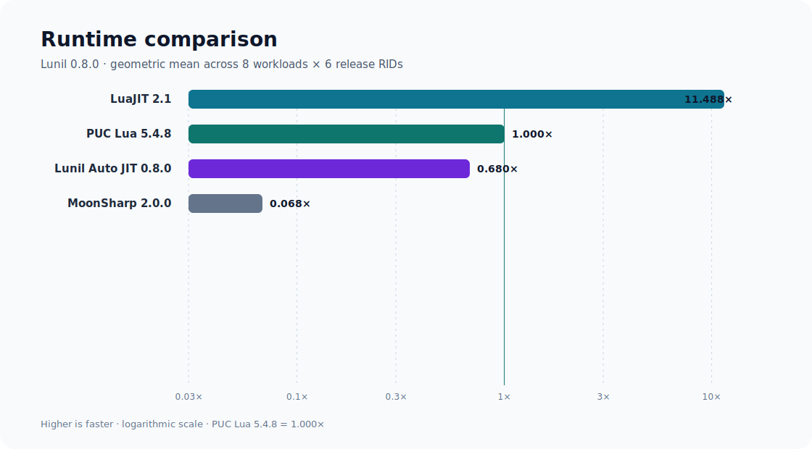
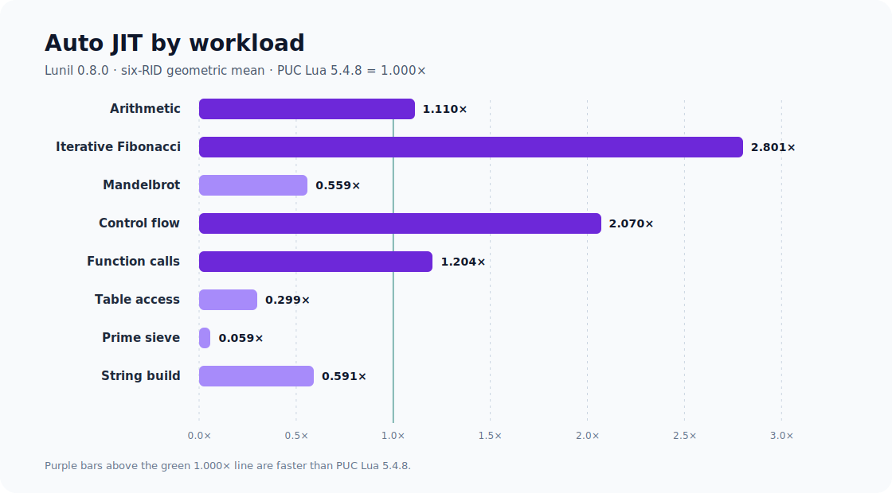
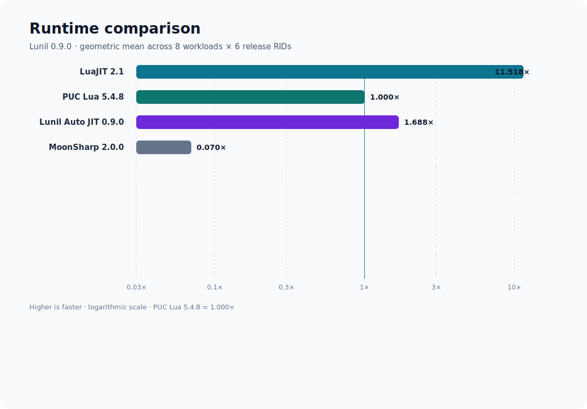
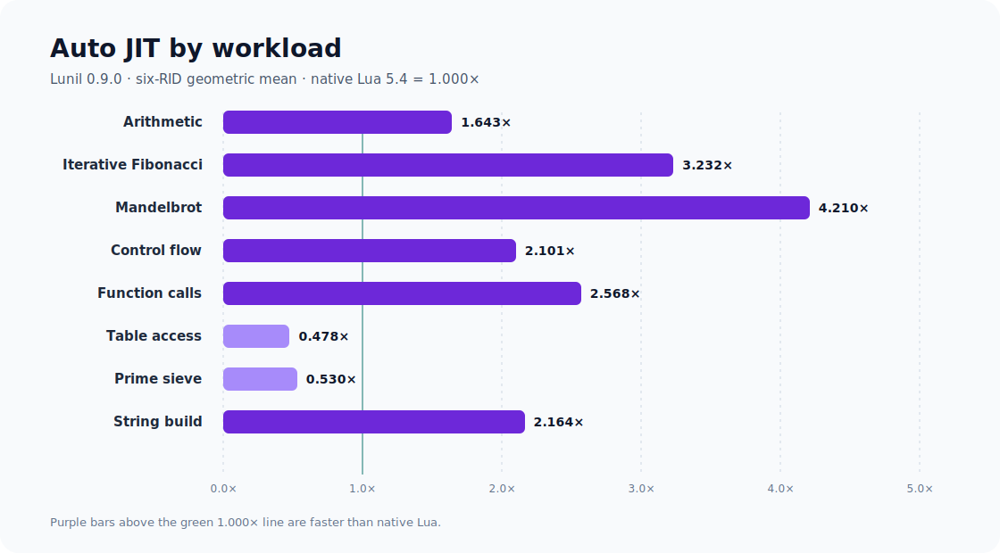

# Performance

Lunil publishes cross-runtime performance results with every performance-sensitive release. The
suite runs identical Lua source on native PUC Lua 5.4.8, LuaJIT, MoonSharp, and each Lunil execution
configuration. Native Lua is normalized to `1.000x`; values above `1.000x` are faster.

## Published `0.8.0` baseline

The stable baseline covers eight workloads on all six release RIDs:

- `win-x64`, `win-arm64`, `linux-x64`, `linux-arm64`, `osx-x64`, and `osx-arm64`;
- six balanced rounds per engine and workload;
- a 250 ms CPU calibration target with a 4× measured-batch safety factor;
- process CPU time per verified logical operation;
- runtime creation, source loading, compilation, and warmup outside the primary interval.

The source data comes from the immutable `0.8.0` product tree and the accepted
[six-RID performance workflow](https://github.com/dlqw/Lunil/actions/runs/29633696197). The compact
machine-readable summary is committed at
[`benchmarks/results/0.8.0-cross-runtime.json`](../benchmarks/results/0.8.0-cross-runtime.json).
The matching backend startup, execution-allocation, and generated-code estimates are available at
[`benchmarks/results/0.8.0-backend.json`](../benchmarks/results/0.8.0-backend.json) and serve as the
versioned regression baseline for unchanged Tier 2 and Loop OSR routes.

### Overall runtime comparison

| Engine | Geomean vs native Lua | Geomean vs MoonSharp |
| --- | ---: | ---: |
| LuaJIT | 11.488x | 168.397x |
| Native Lua 5.4 | 1.000x | 14.657x |
| Lunil Tier 2 | 0.682x | 9.988x |
| **Lunil Auto JIT** | **0.680x** | **9.974x** |
| Lunil Tier 2 (loop-entry OSR) | 0.113x | 1.659x |
| Lunil Tier 1 | 0.105x | 1.543x |
| MoonSharp | 0.068x | 1.000x |
| Lunil interpreter | 0.050x | 0.726x |



### Auto JIT by workload

| Workload | Vs native Lua | Vs MoonSharp | Primary characteristic |
| --- | ---: | ---: | --- |
| Arithmetic | 1.110x | 24.659x | Integer numeric loop |
| Iterative Fibonacci | 2.801x | 40.813x | Repeated numeric calls |
| Mandelbrot | 0.559x | 8.757x | Floating-point control flow |
| Control flow | 2.070x | 34.874x | Branches and loops |
| Function calls | 1.204x | 17.133x | Fixed and variable returns |
| Table access | 0.299x | 8.348x | Array and field reads/writes |
| Prime sieve | 0.059x | 1.464x | Tables mixed with arithmetic |
| String build | 0.591x | 1.521x | Conversion, concatenation, `table.concat` |



Auto JIT and explicit Tier 2 passed the release stability gate on every workload and RID: at least
`1.05x` paired median speedup over MoonSharp, a paired bootstrap CI95 lower bound of at least
`1.00x`, one stable route, correct results, and clean fallback/deoptimization telemetry.

The data also makes the remaining gap explicit. Numeric loops, control flow, and qualified calls
are already competitive with native Lua; table-heavy mixed workloads and string construction are
the primary `0.9.0` optimization targets.

Loop OSR is an entry mechanism for already-running loops, not a third tier. It is measured separately
to expose the cost and benefit of entering specialized code at a loop backedge.

## Stable `0.9.0` release

`0.9.0` is the accepted complete six-RID cross-runtime and backend qualification using the same
workloads, six-round balance, and 250 ms cross-runtime calibration protocol:

| Version and scope | Auto vs native Lua | Auto vs MoonSharp | Stability gate |
| --- | ---: | ---: | --- |
| `0.8.0`, six release RIDs | 0.680x | 9.974x | Passed |
| `0.9.0-alpha.2`, six release RIDs | 0.697x | 9.918x | Passed |
| `0.9.0-alpha.3`, six release RIDs | 0.947x | 13.479x | Passed |
| `0.9.0-alpha.4`, six release RIDs | 1.326x | 18.863x | Passed |
| `0.9.0-alpha.5`, six release RIDs | 1.688x | 24.089x | Passed |
| **`0.9.0`, six release RIDs** | **1.688x** | **24.089x** | **Passed** |

These rows are independent qualification runs rather than paired hardware speedup claims. The
development rows demonstrate current-source correctness, route stability, and performance shape.

The stable release extends the shared Tier 2 region representation to stable strings. String-number
concatenation, string length, and dense string-array writes can stay in one guarded region with
exact operand order, table guards, write barriers, instruction budgets, and deoptimization
ordering. Diagnostic-only component workloads showed that a new dense `table.concat` bulk-copy
path was not justified: the existing dense-string concat path was already faster than native Lua,
while the full `string_build` release workload passed with substantial margin.

| Auto JIT workload | `0.8.0` | `0.9.0-alpha.5` | `0.9.0` target |
| --- | ---: | ---: | ---: |
| `arithmetic` | 1.110x | 1.643x | ≥ 1.100x |
| `fib_iter` | 2.801x | 3.232x | ≥ 2.800x |
| `mandelbrot` | 0.559x | 4.210x | ≥ 0.750x |
| `control_flow` | 2.070x | 2.101x | ≥ 2.000x |
| `function_calls` | 1.204x | 2.568x | ≥ 1.500x |
| `table_access` | 0.299x | 0.478x | ≥ 0.450x |
| `sieve` | 0.059x | 0.530x | ≥ 0.120x |
| `string_build` | 0.591x | 2.164x | ≥ 0.750x |





| Current backend metric | Six-RID result | `0.9.0` limit |
| --- | ---: | ---: |
| Tier 2 compile p95 | 3.924 ms | ≤ 5 ms |
| Tier 2 compile allocation p95 | 243,208 B | ≤ 262,144 B |
| Loop OSR compile p95 | 5.684 ms | ≤ 7.5 ms |
| Loop OSR preparation p95 | 0.113 ms | ≤ 2 ms |
| Loop OSR compile allocation p95 | 184,168 B | ≤ 196,608 B |
| Maximum region allocation growth | 21,777 B/instruction | ≤ 32,768 B/instruction |
| Maximum unchanged-route execution allocation | 1.010x | ≤ 1.05x |
| Maximum unchanged-route estimated code size | 1.124x | ≤ 1.15x |

The compact source report is available at
[`benchmarks/results/0.9.0-performance.json`](../benchmarks/results/0.9.0-performance.json).
It records the accepted product revision and matching six-RID cross-runtime and Beta qualification
metadata. The stable release contains no product-code changes after that accepted qualification.
The qualification also passed the official Lua 5.4.8 user-mode suite, five-backend differential
corpus, deterministic fuzz/GC soak, NativeAOT, trimming, single-file, ReadyToRun, package consumers,
CLI, and public API baselines on the applicable release RIDs.

## Reproduce the benchmark

Install the pinned native tools once, then run the complete matrix:

```powershell
./scripts/Install-CrossRuntimeBenchmarkTools.ps1 -RuntimeIdentifier win-x64
./scripts/Measure-CrossRuntimePerformance.ps1 `
  -RuntimeIdentifier win-x64 `
  -Rounds 6 `
  -TargetMilliseconds 250 `
  -NoProvision
```

During local optimization work, the native baseline and selected Lunil route are sufficient; the
reference-engine comparison is intentionally optional and is reserved for release qualification:

```powershell
./scripts/Measure-CrossRuntimePerformance.ps1 `
  -Workloads string_build `
  -Engines lunil_auto `
  -SkipReference `
  -Rounds 6 `
  -TargetMilliseconds 500 `
  -NoProvision
```

Beta, RC, and stable gates use the complete matrix above, including the reference engine and every
required execution route.

Regenerate or verify the committed charts:

```powershell
./scripts/New-PerformanceCharts.ps1
./scripts/New-PerformanceCharts.ps1 -Verify
./scripts/New-PerformanceCharts.ps1 `
  -DataPath benchmarks/results/0.9.0-alpha.5-performance.json
./scripts/New-PerformanceCharts.ps1 `
  -DataPath benchmarks/results/0.9.0-alpha.5-performance.json `
  -Verify
./scripts/New-PerformanceCharts.ps1 `
  -DataPath benchmarks/results/0.9.0-performance.json `
  -Verify
```

Absolute timings are hardware-specific. Valid version comparisons use the same machine, toolchain,
workload sources, balanced order, and paired samples. The release aggregate uses normalized ratios
and rejects missing RIDs, incorrect results, incomplete engine matrices, unstable routes, or failed
confidence bounds.

The `0.9.0` target matrix and promotion gates are defined in the
[`0.9.0` roadmap](roadmap-0.9.0.md).
